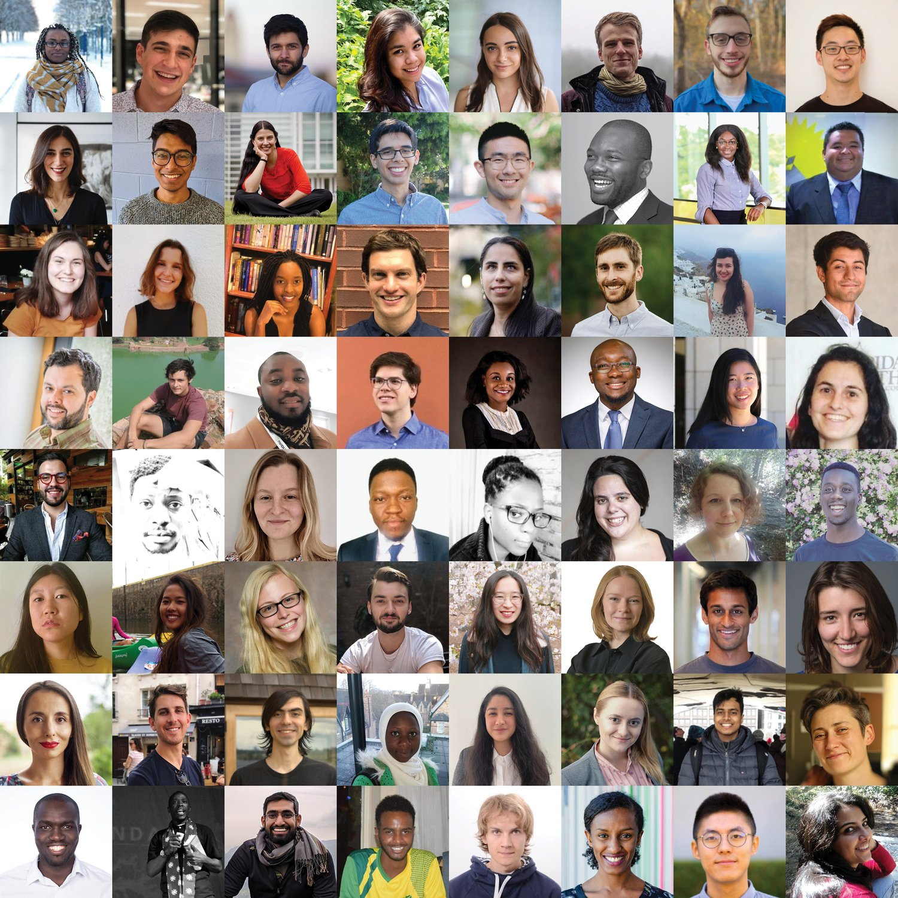

EAAMO Bridges is a multi-institutional initiative using techniques from algorithms, optimization, and mechanism design, along with insights from other disciplines, to improve access to opportunity for historically underserved and disadvantaged communities. EAAMO Bridges is a community of researchers, policy-makers, and practitioners in various government and non-government organizations, community organizations, and industry working to foster collaborations across disciplines and build research and practice pipelines.

We take an interdisciplinary approach to improve equity and social welfare for marginalized groups. We have worked in problems across a variety of domains such as education, development, fairness and discrimination, housing, healthcare, inequality, and labor markets. Our goal is to facilitate interactions across academia, policy, and industry and to foster collaborations across disciplines. To this end, we organize a monthly online colloquium series, domain-specific working groups, workshops and tutorials, and other activities aimed at exploring new research directions, implementing and deploying solutions, and highlighting exemplary work.

- - -

EAAMO Bridges is a part of a global community of researchers and practitioners working towards equity and access. If you are interested in reading more about EAAMO, press on the button below.


EAAMO


EAAMO and EAAMO Bridges organize an annual conference with an aim to highlight work where techniques from algorithms, optimization, and mechanism design, along with insights from the social sciences and humanistic studies, can help improve equity and access to opportunity for historically disadvantaged and underserved communities. The conference provides an international forum for presenting research papers, problem pitches, survey and position papers, new datasets, and software demonstrations towards the goal of bridging research and practice. Please read about this years' conference by pressing the button below.


EAAMO Conference


