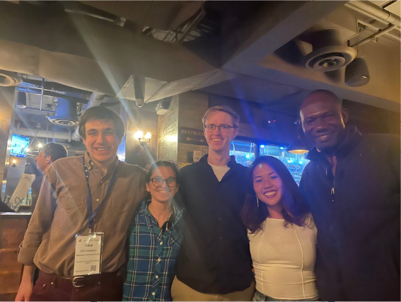

**Lily Xu** organized an MD4SG meetup at the Association for the Advancement of Artificial Intelligence Conference on Artificial Intelligence (AAAI ’23). People from various fields who want to improve access to social goods using artificial intelligence met and discussed their posters, talks, ideas, and other interesting events.

The following papers were presented at AAAI ’23 by members of the MD4SG community:
- Jessica Finocchiaro: [Online Platforms and the Fair Exposure Problem Under Homophily](https://arxiv.org/abs/2202.09727)
- Greg d'Eon: [Better Peer Grading through Bayesian Inference](https://arxiv.org/abs/2209.01242)
- Lily Xu: [Optimistic Whittle Index Policy: Online Learning for Restless Bandits](https://arxiv.org/abs/2205.15372)
- Alex DiChristofano: [Global Performance Disparities Between English-Language Accents in Automatic Speech Recognition](https://arxiv.org/abs/2208.01157)
- Cornelius Adejoro: [Empower Children in Nigeria to Design the Future of Artificial Intelligence (AI) through Writing](https://arxiv.org/abs/2303.13544)

