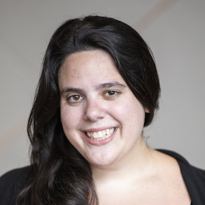

# About

- - -

**Organizers:** [Rediet Abebe](http://www.cs.cornell.edu/~red/) and [Kira Goldner](http://homes.cs.washington.edu/~kgoldner/)  
**Contact:** [organizers@md4sg.com](mailto:organizers@md4sg.com)

  

The organizers of this workshop also co-organize an interdisciplinary, multi-institution research group that explores potential domains for mechanism design for social good.

  

# Organizers

- - -

## Rediet Abebe, Cornell University

- - -

[Rediet Abebe](http://www.cs.cornell.edu/~red/) is a Computer Science PhD student at Cornell University, advised by Professor Jon Kleinberg. Her research focuses on algorithms, computational social science, and applications to social good. She is interested in using techniques and insights from theoretical computer science to better understand and implement interventions for problems related to socioeconomic inequality and opinion dynamics. She is a 2017 recipient of the Facebook Emerging Scholars Program and a 2016 recipient of the Google Generation Scholarship. Prior to Cornell, she completed an M.S. in Applied Mathematics from Harvard University, an M.A. in Mathematics from the University of Cambridge, and a B.A. in Mathematics from Harvard University. She was born and raised in Addis Ababa, Ethiopia.

  

## Kira Goldner, University of Washington

- - -

[Kira Goldner](http://homes.cs.washington.edu/~kgoldner/) is a third-year PhD student in Computer Science and Engineering at the University of Washington, advised by Anna Karlin. Her research focuses on problems in mechanism design, particularly in maximizing revenue in settings that are motivated by practice, such as those where buyer distributions are unknown or buyers are risk-averse. She is also beginning to work on mechanism design within health insurance. She is a 2017 recipient of the Microsoft Research PhD Fellowship and was a 2016 recipient of a Google Anita Borg Scholarship. Kira received her B.A. in Mathematics from Oberlin College and also studied at Budapest Semesters in Mathematics.