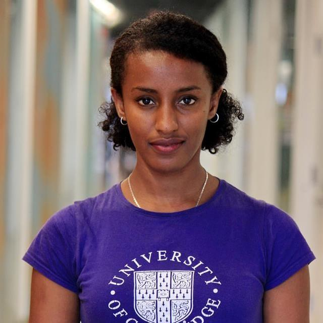

**Organizers:** [Rediet Abebe](http://www.cs.cornell.edu/~red/) and [Kira Goldner](http://homes.cs.washington.edu/~kgoldner/)  
**Contact:** [organizers@md4sg.com](mailto:organizers@md4sg.com)

  

The organizers of this workshop also co-organize an interdisciplinary, multi-institution research group that explores potential domains for mechanism design for social good.

  

# Organizers

- - -

## Rediet Abebe, Cornell University

- - -

[Rediet Abebe](http://www.cs.cornell.edu/~red/) is a third-year PhD student at Cornell University in the Department of Computer Science, advised by Jon Kleinberg. Her research focuses on algorithms, artificial intelligence, and applications to social good. She is specifically interested in using techniques and insights from these areas to better understand and implement interventions for problems related to socioeconomic inequality. Her work has generously been supported by fellowships and scholarships through Facebook (2017-2019), Google (2016-2017), and the Cornell Graduate School (2015-2016). Prior to Cornell, she completed an M.S. in Applied Mathematics from Harvard University, an M.A. in Mathematics from the University of Cambridge, and a B.A. in Mathematics from Harvard University. She was born and raised in Addis Ababa, Ethiopia.

  
  

## Kira Goldner, University of Washington

- - -

[Kira Goldner](http://homes.cs.washington.edu/~kgoldner/) is a fourth-year PhD student at the University of Washington in the Department of Computer Science and Engineering, advised by Anna Karlin. Her research focuses on problems in mechanism design, particularly on (1) maximizing revenue in settings that are motivated by practice and (2) on mechanism design within health insurance and online labor markets. She is a 2017-19 recipient of the Microsoft Research PhD Fellowship and was a 2016 recipient of a Google Anita Borg Scholarship. Kira received her B.A. in Mathematics from Oberlin College and also studied at Budapest Semesters in Mathematics.