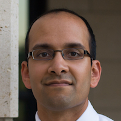

# Invited Speakers

- - -

We will three keynote talks from domain experts on economic inequality, bias and discrimination, and online labor markets. Keynote speakers include:

*   Bias and Discrimination Keynote: [Ifeoma Ajunwa](http://ifeomaajunwa.com/), Cornell University, Industrial and Labor Relations School
*   Economic Inequality Keynote: [Kendra Bischoff](https://sociology.cornell.edu/kendra-bischoff), Cornell University, Department of Sociology
*   Online Labor Markets Keynote: [Ramesh Johari](http://web.stanford.edu/~rjohari/), Stanford University, Management Science and Engineering

We will also research discussions on future directions in the same three areas, featuring domain experts, field experts, and moderated by members of the EC community.  
  
Bias and Discrimination Invited Research Discussants:

*   (Moderator) [Jamie Morgenstern](http://jamiemorgenstern.com/), Georgia Institute of Technology, Computer Science
*   [Ifeoma Ajunwa](http://ifeomaajunwa.com/), Cornell University, Industrial and Labor Relations School
*   [Solon Barocas](http://solon.barocas.org/), Cornell University, Department of Information Science
*   [Brittny Saunders](https://www1.nyc.gov/site/cchr/about/our-team.page), NYC Commission on Human Rights

Economic Inequality Invited Research Discussants:

*   (Moderator) [Nicole Immorlica](http://www.immorlica.com/), Microsoft Research
*   [Kendra Bischoff](https://sociology.cornell.edu/kendra-bischoff), Cornell University, Department of Sociology
*   [Robert Manduca](http://www.robertmanduca.com/), Harvard University, Sociology and Social Policy
*   [Evan Riehl](http://riehl.economics.cornell.edu/), Cornell University, Economics

Online Labor Markets Invited Research Discussants:

*   (Moderator) [Itai Ashlagi](https://web.stanford.edu/~iashlagi/), Stanford University, Management Science and Engineering
*   [Yujie Julie Chen](https://www2.le.ac.uk/departments/media/people/dr-yujie-chen), University of Leicester, Media, Communication, and Sociology
*   [Ramesh Johari](http://web.stanford.edu/~rjohari/), Stanford University, Management Science and Engineering
*   [David Robinson](https://www.upturn.org/about/david-robinson/), Managing Director, Upturn

# Invited Speakers and Research Discussants

- - -

## Ifeoma Ajunwa, Cornell University,  
Industrial and Labor Relations School

- - -

[Ifeoma Ajunwa](http://ifeomaajunwa.com/) is an Assistant Professor in the Organizational Behavior Department of Cornell's Industrial and Labor Relations School. She earned her PhD in Sociology from Columbia University. Her doctoral work received support from the National Science Foundation (NSF) and honorable mention by the Ford Foundation. Immediately prior to her position at Cornell ILR School, she was a Fellow at the Berkman Klein Center at Harvard University (where she remains a Faculty Associate) and she served as a Teaching Fellow at Harvard Law School. Professor Ajunwa researches the organizational behavior of organizations, particularly in relation to stigma/social evaluation, diversity, and the adoption of new work technologies. Other related research interests include labor and employment law, as well as, business and society concerns.

  
  

## Itai Ashlagi, Stanford University,  
Management Science and Engineering

- - -

[Itai Ashlagi](https://web.stanford.edu/~iashlagi/) is an Assistant Professor at the Management Science & Engineering Department. He is interested in game theory and the design of marketplaces and especially matching markets. His work influenced the practice of Kidney exchange, for which he has become a Franz Edelman Laureate. Ashlagi received his PhD in operations research from the Technion-Israel Institute of Technology. Before coming to Stanford he was an assistant professor of Operations Management at Sloan, MIT and prior to that a postdoctoral researcher at HBS. He received the outstanding paper award in the ACM conference of Electronic Commerce 2009 and the NSF-CAREER award.

  
  

## Solon Barocas, Cornell University,  
Department of Information Science

- - -

[Solon Barocas](http://solon.barocas.org/) is an Assistant Professor in the Department of Information Science at Cornell University. His current research explores ethical and policy issues in artificial intelligence, particularly fairness in machine learning, methods for bringing accountability to automated decision-making, and the privacy implications of inference. In 2014, he co-founded Fairness, Accountability, and Transparency in Machine Learning (FAT/ML), an annual workshop that brings together an emerging community of researchers working on these issues. He went on to help launch Fairness, Accountability, and Transparency as a stand-alone conference in 2018. Solon was previously a Postdoctoral Researcher at Microsoft Research, where he worked with the Fairness, Accountability, Transparency, and Ethics in AI group, as well as a Postdoctoral Research Associate at the Center for Information Technology Policy at Princeton University. He completed his doctorate in the Department of Media, Culture, and Communication at New York University, where he remains a Visiting Scholar at the Center for Urban Science + Progress.

  
  

## Kendra Bischoff, Cornell University,  
Department of Sociology

- - -

[Kendra Bischoff](https://sociology.cornell.edu/kendra-bischoff) is an assistant professor of sociology at Cornell University. She received her PhD in sociology from Stanford University and was subsequently a post-doctoral fellow in equality of opportunity and education at Stanford University's Center for Ethics in Society. Her research focuses on social stratification and inequality, schooling, social demography, and urban sociology. In current and past projects, she investigates the causes and consequences of racial and economic residential segregation, the changing demographic relationship between schools and their local neighborhoods, and the civic mission of K-12 schools. She is currently a National Academy of Education / Spencer Foundation Fellow.

  
  

## Yujie Julie Chen, University of Leicester,  
Media, Communication, and Sociology

- - -

[Yujie Julie Chen](https://www2.le.ac.uk/departments/media/people/dr-yujie-chen) is a Lecturer in Digital Media and Communication in the School of Media, Communication and Sociology at the University of Leicester. She studies and writes about digital labor issues, particularly focusing on 1) how interplay among technologies, cultural contexts, and existing socio-economic structures impacts on the experience and perceptions of digital work and 2) how workers' lived experience technologies help them construct their own narratives. She has published works on drivers on ride-hailing platforms in China. She is working on two projects at the moment. The first one is a book manuscript on why labor is missing from the framework of datafication, and the second one is to explore the platform workers's work world in China, primarily gig drivers and food-deliver app workers.

  
  

## Nicole Immorlica, Microsoft Research

- - -

[Nicole Immorlica](http://www.immorlica.com/)'s research lies broadly within the field of algorithmic game theory. Using tools and modeling concepts from both theoretical computer science and economics, Nicole hopes to explain, predict, and shape behavioral patterns in various online and offline systems, markets, and games. Her areas of specialty include social networks and mechanism design. Nicole received her Ph.D. from MIT in Cambridge, MA in 2005 and then completed three years of postdocs at both Microsoft Research in Redmond, WA and CWI in Amsterdam, Netherlands before accepting a job as an assistant professor at Northwestern University in Chicago, IL in 2008. She joined the Microsoft Research New England Lab in 2012.

  
  

## Ramesh Johari, Stanford University,  
Management Science and Engineering

- - -

[Ramesh Johari](http://web.stanford.edu/~rjohari/) is an Associate Professor at Stanford University, with a full-time appointment in the Department of Management Science and Engineering (MS&E), and courtesy appointments in the Departments of Computer Science (CS) and Electrical Engineering (EE). He is a member of the Operations Research group and the Social Algorithms Lab (SOAL) in MS&E, the Information Systems Laboratory in EE, and the Institute for Computational and Mathematical Engineering. He received an A.B. in Mathematics from Harvard, a Certificate of Advanced Study in Mathematics from Cambridge, and a Ph.D. in Electrical Engineering and Computer Science from MIT. His research interests include design, analysis, and optimization of online platforms.

  

## Robert Manduca, Harvard University,  
Sociology and Social Policy

- - -

[Robert Manduca](http://www.robertmanduca.com/) is a PhD student in sociology and social policy at Harvard University. His research focuses on urban economic development and on the effects of economic inequality on US society. Current projects include documenting trends in absolute income mobility in the US and abroad and exploring the causes of economic polarization between US metro areas. Prior to beginning his PhD he completed a Master's in City Planning at MIT and was a fellow at Data Science for Social Good.

  
  

## Jamie Morgenstern,  
Georgia Institute of Technology

- - -

[Jamie Morgenstern](http://jamiemorgenstern.com/) is an assistant professor in the School of Computer Science Georgia Tech. Prior to this appointment, she was fortunate to be hosted by Michael Kearns, Aaron Roth, and Rakesh Vohra for a Warren Center postdoc at the University of Pennsylvania, and completed her PhD working with Avrim Blum at Carnegie Mellon University. She studies the social impact of machine learning and the impact of social behavior on ML's guarantees. How should machine learning be made robust to behavior of the people generating training or test data for it? How should ensure that the models we design do not exacerbate inequalities already present in society?

  

## Evan Riehl, Cornell University, Economics

- - -

[Evan Riehl](http://riehl.economics.cornell.edu/) is an assistant professor in the Department of Economics and ILR School at Cornell University. He received a PhD in economics from Columbia University in 2017 and a BA in economics/political science from Washington University in St. Louis in 2008. His research interests are in labor and development economics with a focus on higher education. His recent work examines how signals of individual ability affect the match between students and colleges, and their implications for labor market outcomes. This includes projects on the design of college admission exams, the role of college reputation, and the interaction between college grading policies and peer quality.

  
  

## David Robinson, Managing Director, Upturn

- - -

[David Robinson](https://www.upturn.org/about/david-robinson/) is a Managing Director and cofounder of Upturn. David works to empower the public, advocates, and policymakers to influence the high tech systems that shape our daily lives, from courtroom algorithms to 'predictive policing' systems to gig economy platforms. He has a long-term interest in concrete ways that data-driven systems can support, or frustrate, civic goals of justice, equity and opportunity. Before Upturn, David served as the inaugural Associate Director of Princeton University's Center for Information Technology Policy, a joint venture between the university's School of Engineering and its Woodrow Wilson School of Public and International Affairs. David serves as an Adjunct Professor of Law at Georgetown University Law Center, where he teaches a seminar he created on Governing Automated Decisions. He holds a JD from Yale Law School, and bachelor's degrees in philosophy from Princeton and Oxford, where he was a Rhodes Scholar.

  
  

## Brittny Saunders, NYC Commission on  
Human Rights

- - -

[Brittny Saunders](https://www1.nyc.gov/site/cchr/about/our-team.page) is Deputy Commissioner for Strategic Initiatives at the NYC Commission on Human Rights ('Commission'). At the Commission, Brittny manages key inter-agency partnerships and special projects related to data-driven discrimination and racial justice among others. Before joining the Commission, Brittny worked for the Office of the Mayor, most recently as Acting Counsel to the Mayor. Prior to that, as Deputy Counsel, Brittny played a central role in the Office's broadband equity efforts, working to ensure affordable access to high-speed internet for residents of the five boroughs. Brittny also helped craft legislation barring discrimination on the bases of credit and criminal history in the employment context, codifying the Commission on Gender Equity ('CGE') and addressing other important challenges facing the city. Before joining local government, Brittny worked for the Center for Popular Democracy ('CPD'), where she was Supervising Attorney for Immigrant Rights and Racial Justice, driving policy development and advocacy on a range of topics including education and language access. Prior to that, Brittny was Senior Advocate at the Center for Social Inclusion ('CSI' now 'RaceForward'), where she worked on disaster and emergency, broadband, transportation and transparency and accountability policies from a racial justice perspective. Brittny was a 2010 Fellow in Media, Information & Communications Policy with the Rockwood Leadership Institute. She has an A.B. from Harvard College and a J.D. from Harvard Law School.