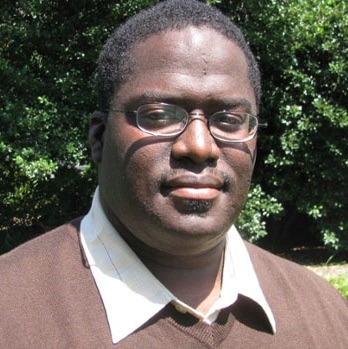
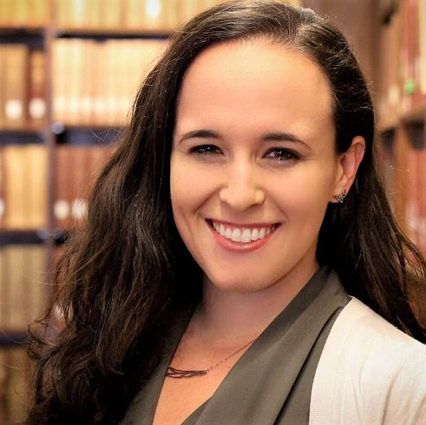
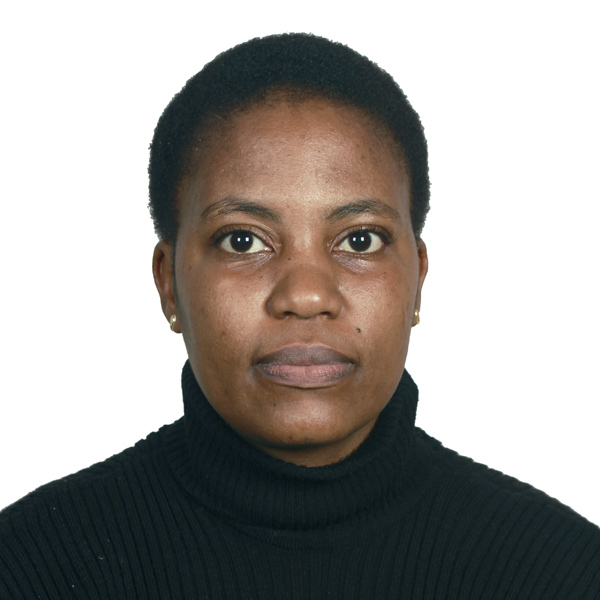

We will have three keynote talks from domain experts on improving access to opportunity in developing nations, through assignments and choice, and in conjunction in law and policy. Our invited keynote speakers are:

*   Developing Nations: [Sekou L. Remy](https://researcher.watson.ibm.com/researcher/view.php?person=ke-Sekou.Lionel.Remy), IBM Research - Africa
*   Assignments and Choice: [Ariel Procaccia](http://procaccia.info/), Carnegie Mellon University, Department of Computer Science
*   Law and Policy: [Valerie Thomas](https://www2.isye.gatech.edu/people/faculty/Valerie_Thomas/), Georgia Institute of Technology, Industrial and Systems Engineering (and Public Policy)

We will also feature a panel discussion on bridging research and practice. Our invited panelists are:

*   Moderator: [Sera Linardi](https://www.linardi.gspia.pitt.edu/), University of Pittsburgh, Graduate School of Public and International Affairs and Department of Economics
*   [Miranda Bogen](https://www.upturn.org/about/miranda-bogen/), Upturn
*   [Dina Machuve](https://twiga2.github.io/dmachuve/), Nelson Mandela African Institution of Science and Technology
*   [Valerie Thomas](https://www2.isye.gatech.edu/people/faculty/Valerie_Thomas/), Georgia Institute of Technology, Industrial and Systems Engineering (and Public Policy)

  

# Keynote Speakers Bios

- - -

## IBM Research - Africa  

- - -

[Sekou L. Remy](https://researcher.watson.ibm.com/researcher/view.php?person=ke-Sekou.Lionel.Remy) is a Research Scientist and Technical Lead at IBM Research - Africa. A member of the healthcare team, he is excited about developing appropriate technologies based on Artificial Intelligence, Machine Learning, Blockchain and data analytics which will transform Africa, and the world. As the lead for the Policy Making with AI, one specific research effort explores the application these technologies to transform the development of intervention policies which will accelerate the eradication of malaria. Remy has a Bachelor�s degree in Computer Science from Morehouse College, and a Doctor of Philosophy (Ph.D.) in Electrical and Computer Engineering from the Georgia Institute of Technology.

  
  

## Carnegie Mellon University,  
Department of Computer Science  

- - -

[Ariel Procaccia](http://procaccia.info/) is an Associate Professor in the Computer Science Department at Carnegie Mellon University. He works on a broad and dynamic set of problems related to AI, algorithms, economics, and society. His distinctions include a Guggenheim Fellowship (2018), the IJCAI Computers and Thought Award (2015), a Sloan Research Fellowship (2015), an NSF CAREER Award (2014), and the IFAAMAS Victor Lesser Distinguished Dissertation Award (2009). To make his research accessible to the public, he has founded the not-for-profit websites Spliddit.org and RoboVote.org, and has written op-eds for the Washington Post, Wired, and Bloomberg (where he is a regular contributor).

  
  

## Georgia Institute of Technology,  
Industrial and Systems Engineering  

- - -

[Valerie Thomas](https://www2.isye.gatech.edu/people/faculty/Valerie_Thomas/) is the Anderson Interface Professor of Natural Systems in the School of Industrial and Systems Engineering at Georgia Tech, with a joint appointment in the School of Public Policy. Current research projects include energy in sub-Saharan Africa and U.S. bioenergy development. She is Associate Editor for the Journal of Industrial Ecology, and a member of the USDA/DOE Biomass R&D Technical Advisory Committee. She has held positions at Princeton and Carnegie Mellon, and has served as a Congressional Science Fellow. She has a PhD in high energy physics from Cornell and a B.A. in physics from Swarthmore.

  
  

# Panelist Bios

- - -

## Upturn  

- - -

[Miranda Bogen](https://www.upturn.org/about/miranda-bogen/) is a Senior Policy Analyst at Upturn, where she focuses on the implications of machine learning and artificial intelligence for civil and human rights, and particularly on the intersection of digital technology, automated decisions, and economic opportunity.

  
  

## University of Pittsburgh,  
Economics, Graduate School of Public and International Affairs  

- - -

[Sera Linardi](https://www.linardi.gspia.pitt.edu/) is an Associate Professor of Economics at the Graduate School of Public and International Affairs (GSPIA) at the University of Pittsburgh. She is an experimental economist who focuses on bridging academic research and the day-to-day challenges facing those who provide services to vulnerable populations.

  
  

## Nelson Mandela African Institution of Science and Technology (NM-AIST),  

- - -

[Dina Machuve](https://twiga2.github.io/dmachuve/) is a Lecturer and Researcher at the Nelson Mandela African Institution of Science and Technology (NM-AIST) in Arusha, Tanzania. She holds a PhD in Information and Communication Science and Engineering from NM-AIST in 2016. She co-organizes the Data Science Africa (DSA), an organization that runs an annual data science and machine learning summer school and workshop in Africa.