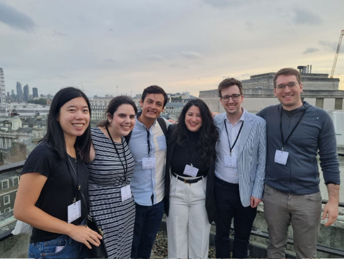
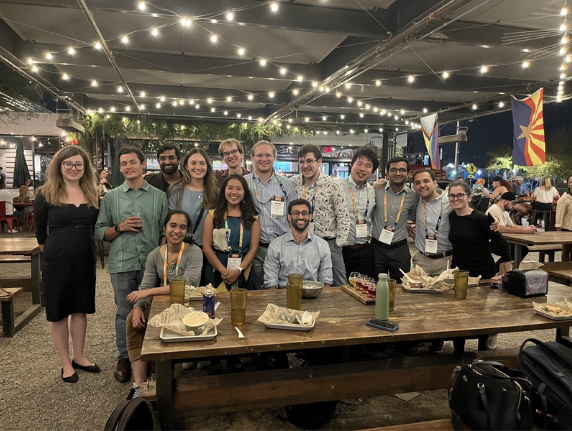

The ACM Conference on Economics and Computation (EC '23) was a highly anticipated event that unfolded from July 9 to July 12, 2023, at the King's College London. This gathering brought together a multitude of experts and enthusiasts – and among them members of the MD4SG community. They engaged in dynamic discussions that spanned a wide range of topics pertaining to the intersection of economics and computation methods. Please take a look at the papers that were co-authored by MD4SG members.

- *Blockchain Mediated Persuasion*, Kimon Drakopoulos (USC); Irene Lo (Stanford University); Justin Mulvany (USC)
- *Welfare-Maximizing Pooled Testing*, Simon Finster (CREST-ENSAE); Michelle González Amador (UNU-MERIT & Maastricht University); Edwin Lock (University of Oxford); Francisco Marmolejo Cossio (Harvard University); Evi Micha (University of Toronto); Ariel Procaccia (Harvard University)
- *Leveraging Reviews*: Learning to Price with Buyer and Seller Uncertainty, Wenshuo Guo (UC Berkeley); Nika Haghtalab (UC Berkeley); Kirthevasan Kandasamy (UW Madison); Ellen Vitercik (Stanford University)
- *Capacity Planning in Stable Matching*: An Application to School Choice, Federico Bobbio (University of Montreal); Margarida Carvalho (University of Montreal); Andrea Lodi (Jacobs Technion-Cornell Institute, Cornell Tech); Ignacio Rios (The University of Texas at Dallas); Alfredo Torrico (Polytechnique Montreal)
- *In Defense of Liquid Democracy*, Daniel Halpern (Harvard University); Joseph Halpern (Cornell University); Ali Jadbabaie (MIT); Elchanan Mossel (MIT); Ariel Procaccia (Harvard University); Manon Revel (MIT, Harvard University)
- A special congratulations goes to **Paul Gölz**, our Civic Participation working group organizer, whose dissertation entitled “Social Choice for Social Good: Proposals for Democratic Innovation from Computer Science” got an honorable mention.

- - -
Several days later, a different group of MD4SG members met at INFORMS '23.

