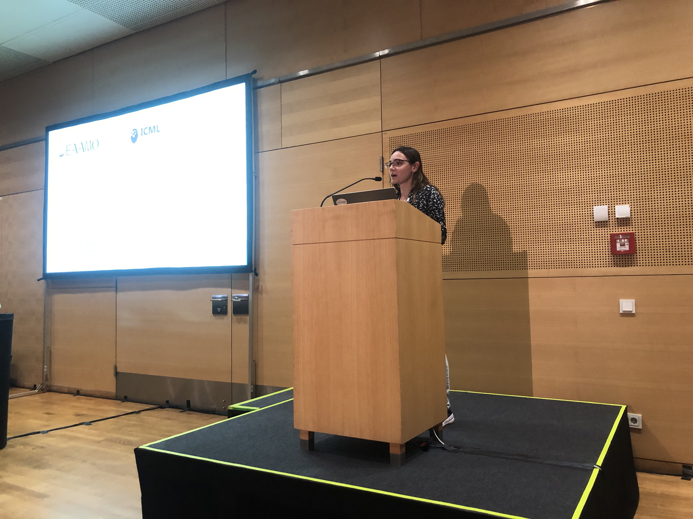
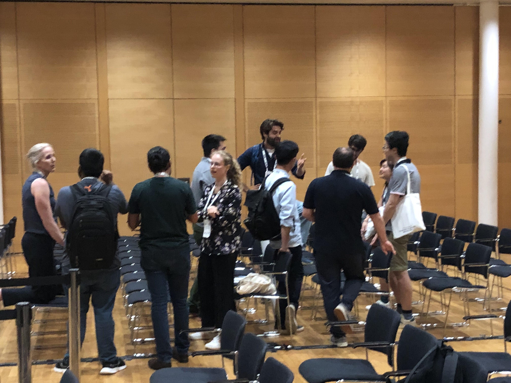

The [International Conference on Machine Learning (ICML) 2024](https://icml.cc/Conferences/2024) saw the successful organization of the "Equity and Access in Algorithms, Mechanisms, and Optimization" social event. The gathering aimed to discuss the critical issue of bridging machine learning research and practice to ensure equitable access and opportunities for marginalized groups.

The event commenced with a presentation by EAAMO directors [Ana-Andreea Stoica](https://sf.is.mpg.de/person/astoica) and [Sandro Radovanović](https://sandror.netlify.app/), who elaborated on EAAMO's mission, vision, and achievements from previous working groups. They also provided a sneak peek into the upcoming [ACM EAAMO 2024](https://conference.eaamo.org/) and a soon-to-be-announced social hackathon.

In line with EAAMO's mission to foster collaboration between junior and senior scientists and practitioners, the event featured two presentations. [Celestine Mendler-Dünner](https://celestine.ai/), a Principal Investigator at the [ELLIS Institute](https://ellis.eu/) in Tübingen, discussed "Algorithmic Collective Actions," offering insights into Celestine’s work. [Luke Guerdan](https://lukeguerdan.com/), a PhD student at Carnegie Mellon University's Human-Computer Interaction Institute, shortly presented his rewarded paper, "Counterfactual Prediction Under Outcome Measurement Error."

Following the presentations, attendees engaged in informal discussions at designated tables, exploring ideas, work, and potential collaborations. The discussions primarily focused on machine learning tools for algorithmic fairness, strategic behavior, and feedback loops, fostering a vibrant exchange of knowledge and innovation.

