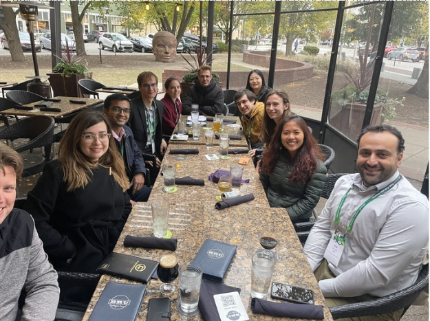
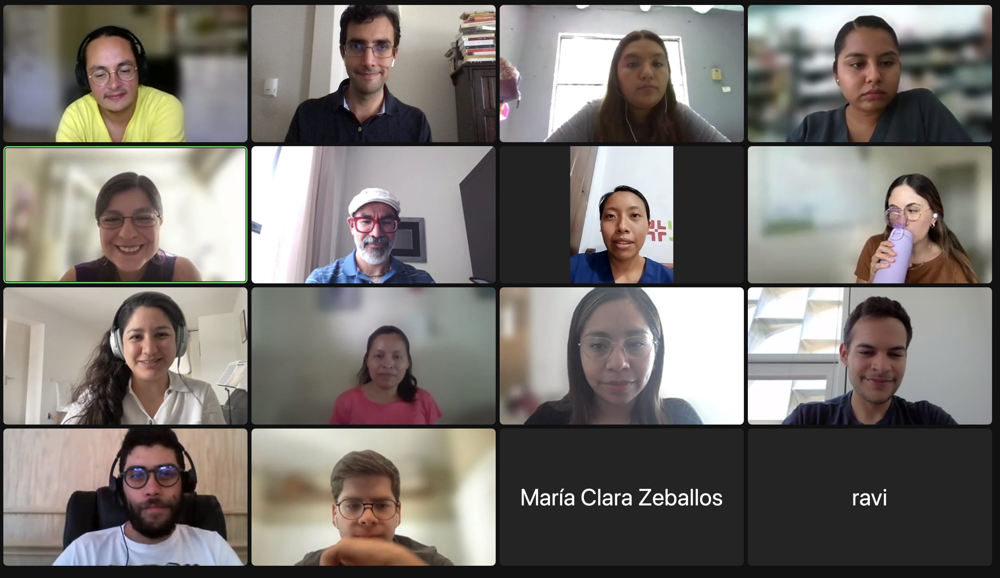
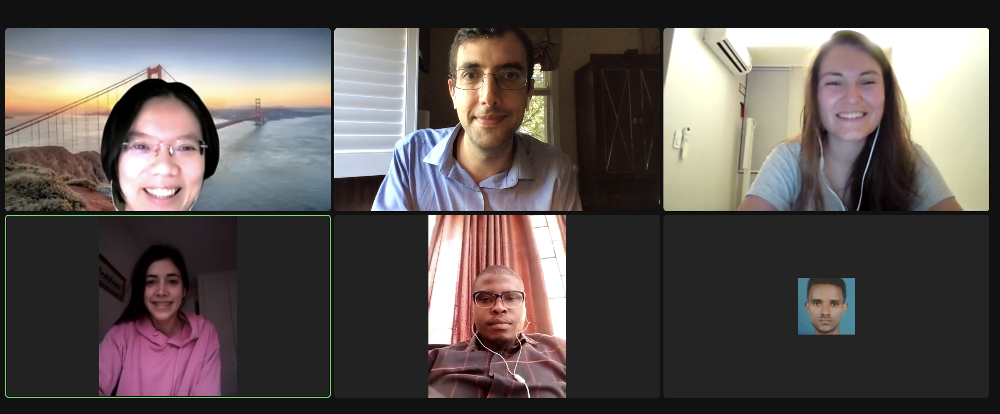

MD4SG organized a second annual in-person MD4SG dinner social at INFORMS. People from a variety of research areas met and discussed their research and other hobbies.

- - -

During the Fall '22 semester, we were piloting the first long-term MD4SG mentorship program this academic year, matching mentors to small groups of mentees to discuss topics like how to find the right graduate program, maintain a healthy work-life balance, and more. These small groups touch base about once per month so that mentors and mentees can learn from one another throughout the year. In the end, we were able to match thirty-seven mentees with twelwe mentors and would like to thank everyone who applied to the program for their participation and excitement. None of this would be possible without **Renzhe Yu**, **Sakina Hansen**, and **Jessie Finocchiaro** from the Community Engagement team for setting up the mentorship program.

**Roozbeh Yousefzadeh** organized a Discord meetups around at the same time as INFORMS '22.

- - -
The Community Engagement team organized an informal discussion this fall to support students who are thinking about or currently applying for PhD programs. A couple of PhD students per geographic region (North America, Latin America and the Caribbean, Africa and the Middle East, Europe, Asia/Pacific) gave participants insights about PhD applications in general and answered specific questions about their geographic regions. This was an excellent opportunity to get advice on applications from PhD students from different regions around the globe, and we will surely continue having these events. A special thanks to **Corinna Hertweck**, who organized this event and to the current PhD students who helped us with this event.

- Xudong Shen (National University of Singapore)
- Alyssa Columbus (Johns Hopkins University)
- Eugenia Iofinova (Institute of Science and Technology, Austria)
- Corinna Hertweck (University of Zurich)
- Shubham Singh (University of Illinois Chicago)
- Sean Sinclair (Cornell University)
