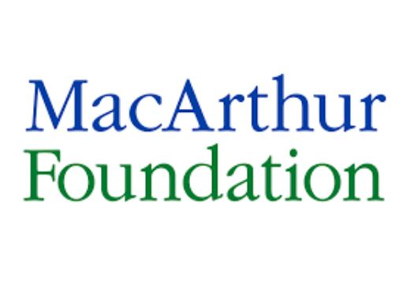
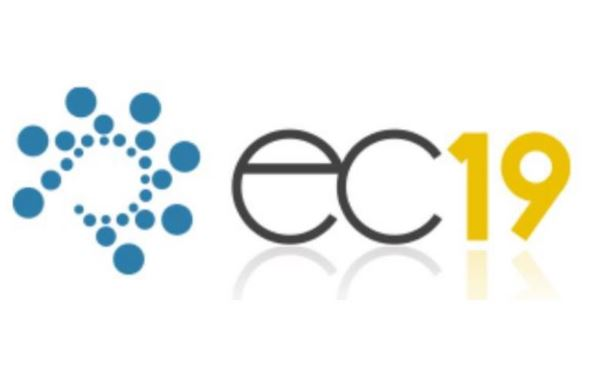
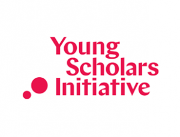

June 28, 2019 at Phoenix, AZ, USA

### Congratulations to the MD4SG'19 award winners.

Best paper: **Zoe Hitzig**, _"Bridging the 'Normative Gap': Mechanism Design and Social Justice"_  
Best paper with a student presenter: **Anay Mehrotra**, _Toward Controlling Discrimination in Online Ad Auctions_  
Popular poster awards: **Daniel Mutembesa**, _"Incentive Mechanism for Mobile Community Sensing with Smallholder Farmers in a Developing Nation"_, and **Min Kyung Lee**, _"WeBuildAI: Participatory Framework for Algorithmic Governance"_

### The Youtube livestreams for the [morning](https://www.youtube.com/watch?v=Bc1CECIxio0) and [afternoon](https://www.youtube.com/watch?v=rF5hq9o_TfE) sessions are available online.

- - -

The third workshop on **Mechanism Design for Social Good** (MD4SG '19) will be held in conjunction with the [20th ACM Conference on Economics and Computation (EC '19)](http://sigecom.org/ec19/) in Phoenix, Arizona, USA on June 28, 2019. The goal of the workshop is to highlight work where techniques from algorithms, optimization, and mechanism design, along with insights from other disciplines, have the potential to improve access to opportunity for historically underserved and marginalized communities. The workshop will feature keynote presentations, contributed talks, problem pitches and demos, a poster session, and a panel discussion, with a focus on _bridging research and practice_. To this end, participants will include researchers as well as practitioners in various government and non-government organizations and industry.

  

The workshop will have four main components:

*   Keynote talks from leading academics and domain experts in _Development_, _AI Ethics_, and _Energy and Climate Change_,
*   Presentations of submitted papers by members of the EC community, and
*   Problem pitches and product demonstrations from domain experts and practitioners,
*   A panel discussion on bridging research and practice, with a focus on the limitations of theoretical modeling in providing implementable solutions.

The goal of this workshop is fourfold:

1.  Expose the EC community to new and emerging research directions through invited talks,
2.  Foster collaborations with domain experts, including those outside of the academy, through problem pitches and a networking event,
3.  Jointly brainstorm and formalize research problems that the community can work on, and
4.  Highlight exemplary work from the EC community and adjacent communities that falls under this theme.

More generally, we see this workshop as part of a broader goal to create and raise interest in different algorithmic and mechanism design problems with a social good objective.

  

# Sponsors

- - -

The Third Workshop on Mechanism Design for Social Good is generously supported by _Schmidt Futures_, the _MacArthur Foundation_, the _ACM Conference on Economics and Computation_, and the _Institute for New Economic Thinking -- Young Scholars Initiative_.

  
  

**Organizers:** [Rediet Abebe](http://www.cs.cornell.edu/~red/) and [Irene Lo](https://sites.google.com/view/irene-lo)  
**Contact:** [organizers@md4sg.com](mailto:organizers@md4sg.com)