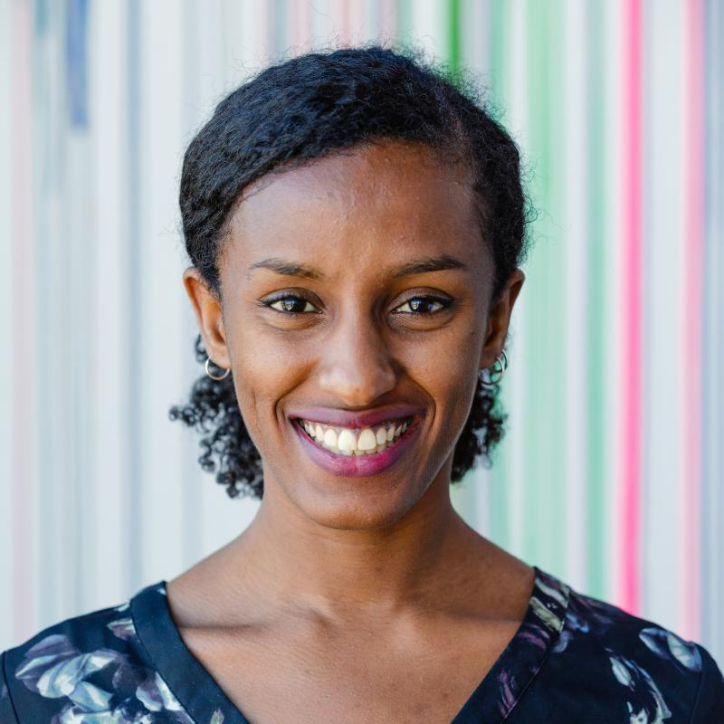
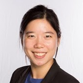

**Organizers:** [Rediet Abebe](http://www.cs.cornell.edu/~red/) and [Irene Lo](https://sites.google.com/view/irene-lo)  
**Contact:** [organizers@md4sg.com](mailto:organizers@md4sg.com)

  

The organizers of this workshop also co-organize an interdisciplinary, multi-institution research initiative by the same theme.

  

# Organizers

- - -

## Rediet Abebe, Cornell University

- - -

[Rediet Abebe](http://www.cs.cornell.edu/~red/) is a Ph.D. candidate in computer science at Cornell Univerity where she is advised by Professor Jon Kleinberg. Her research focuses on algorithms, computational social science, AI, and their applications to social good. As part of this research agenda, she co-founded and co-organizes Mechanism Design for Social Good (MD4SG) and Black in AI, an international network of over 1000 individuals focused on increasing the presence and inclusion of Black individuals in AI. Her research is deeply influenced by her upbringing in her hometown of Addis Ababa, Ethiopia. Her work has been generously supported by fellowships and scholarships through Facebook, Google, the Cornell Graduate School, and the Harvard-Cambridge Fellowship.

  
  

## Irene Lo, Stanford University

- - -

[Irene Lo](https://sites.google.com/view/irene-lo) is a postdoctoral scholar in the Economics department at Stanford University, and will join the department of Management Science & Engineering at Stanford University as an assistant professor in Fall 2019. In her research, she develops and harnesses tools from operations, computer science, and economics to design effective matching markets and marketplace platforms, with a focus on public sector applications and socially responsible operations research. She is a co-organizer of the Mechanism Design for Social Good research initiative. She obtained her Ph.D. from the IEOR department at Columbia University in 2018, under the supervision of Jay Sethuraman and Jacob Leshno, and graduated from Princeton University in 2013 with an A.B. in mathematics.