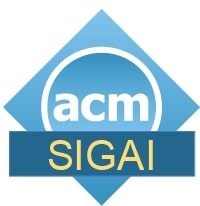

The fourth workshop on **Mechanism Design for Social Good** (MD4SG '20) will be held online on August 17-19, 2020. The goal of the workshop is to highlight work where techniques from algorithms, optimization, and mechanism design, along with insights from other disciplines, have the potential to improve access to opportunity for historically underserved and marginalized communities. The workshop will feature keynote presentations, contributed talks, problem pitches and demos, a poster session, and a panel discussion, with a focus on _bridging research and policy_. To this end, participants will include researchers as well as practitioners in various government and non-government organizations and industry.

 

# News

- - -

*   Check-out the 🌟[MD4SG Awards](community/md4sg_20/awards) 🌟
*   We will hold a social / troubleshooting session on **Sunday August 16 from 1200-1300 ET**. You can find more information on our [virtual venue guide](community/md4sg_20/virtual_venue)
*   MD4SG '20 will now be held over 3 days, from August 17-19

 

# Calendar

Check out our full program [here](program) and subscribe to our calendar at [this link](https://calendar.google.com/calendar?cid=dTZqdnE1dW9pNjdiaXE2bGlvZ3Zkb2RoM2tAZ3JvdXAuY2FsZW5kYXIuZ29vZ2xlLmNvbQ).

 

 

# Sponsors

- - -

The Third Workshop on Mechanism Design for Social Good is generously supported by the _ACM Special Interest Group on Artificial Intelligence (SIGAI)_.

 

**Organizers:** [Faidra Monachou](https://web.stanford.edu/~monachou) and [Francisco Marmolejo-Cossío](http://fmarmolejo.com/)  
**Contact:** [monachou@stanford.edu](mailto:monachou@stanford.edu), [francisco.marmolejo@cs.ox.ac.uk](mailto:francisco.marmolejo@cs.ox.ac.uk)