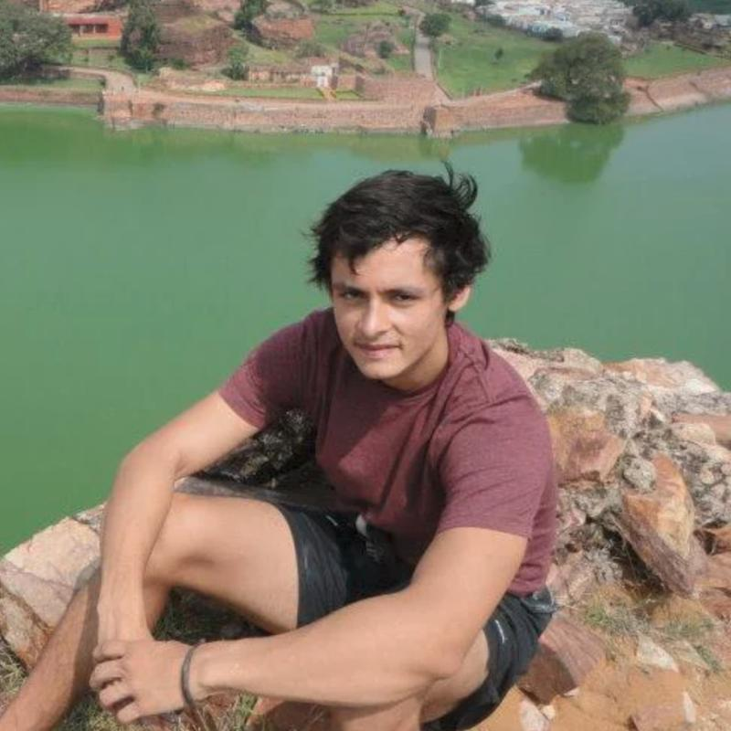
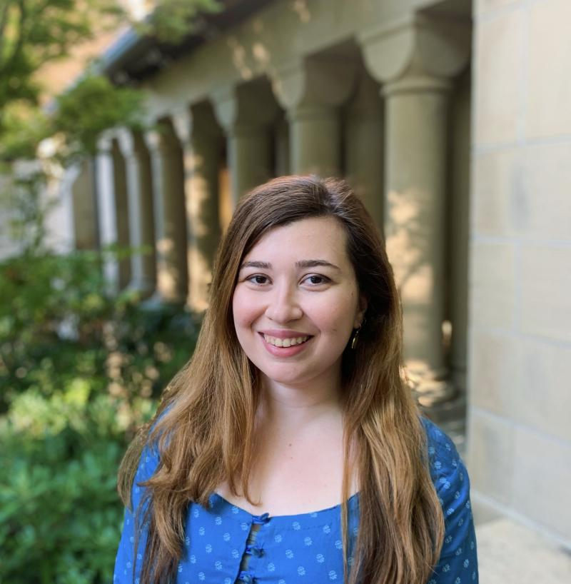

**Organizers:** [Francisco J. Marmolejo Cossio](https://www.fmarmolejo.com/) and [Faidra Monachou](https://profiles.stanford.edu/faidra-georgia-monachou)  
**Contact:** [monachou@stanford.edu](mailto:monachou@stanford.edu), [francisco.marmolejo@cs.ox.ac.uk](mailto:francisco.marmolejo@cs.ox.ac.uk)

 

# Program Chairs

- - -

 

## Francisco J. Marmolejo Cossio, University of Oxford

- - -

[Francisco J. Marmolejo Cossio](https://www.fmarmolejo.com/) is a Career Development Fellow in Computer Science at Balliol College within the University of Oxford. He is also a Research Fellow at Input Output Hong Kong (IOHK). His research lies at the intersection of Algorithmic Game Theory, Decentralised Consensus Protocols and Computational Learning Theory. His work has focused on establishing query-efficient protocols for equilibrium computation as well as understanding incentives in decentralised systems. Francisco holds a D.Phil. in Computer Science and an M.Sc. in Mathematics and Foundations of Computer Science from the University of Oxford, as well as a B.A. in Mathematics from Harvard University. Francisco is originally from San Luis Potosi, Mexico, and has been co-organizing the development working group since Spring 2019. Francisco has also been co-organizing the MD4SG initiative as a whole since Spring 2020.

   

## Faidra Monachou, Stanford University

- - -

[Faidra Monachou](https://web.stanford.edu/~monachou) is a Ph.D. candidate in Operations Research at the Department of Management Science and Engineering at Stanford University, advised by Itai Ashlagi. Her work focuses on market design and matching theory, and aims at understanding the theoretical foundations of socioeconomic problems that arise in large-scale online markets. She is particularly interested in the study of bias and discrimination in the sharing economy, labor markets and education as well as the role of information design and learning in redesigning non-monetary matching markets. Before coming to Stanford, she graduated from National Technical University of Athens in Greece, where she studied Electrical Engineering and Computer Science. Faidra has been member of the MD4SG initiative since Fall 2018. She has been serving as a co-organizer of the MD4SG Bias, Discrimination, and Fairness working group since Fall 2019.

 

# Steering Committee

- - -

*   [Rediet Abebe](https://www.cs.cornell.edu/~red/), Harvard University
*   [Kira Goldner](https://www.kiragoldner.com/), Columbia University
*   [Jon Kleinberg](http://www.cs.cornell.edu/home/kleinber/), Cornell University
*   [Illenin Kondo](https://www.illenin.com/), University of Notre-Dame
*   [Sera Linardi](http://www.linardi.gspia.pitt.edu/), University of Pittsburgh
*   [Irene Lo](https://sites.google.com/view/irene-lo), Stanford University
*   [Ana-Andreea Stoica](http://www.columbia.edu/~as5001/), Columbia University

# Area Chairs

- - -

*   **Theory:** [Daniel Freund](https://mitsloan.mit.edu/faculty/directory/daniel-freund), MIT Sloan; [Sam Taggart](http://www.samueltaggart.com/), Oberlin College; [Matt Weinberg](http://www.cs.princeton.edu/~smattw/), Princeton University
*   **Empirical Studies and Policy:** [Zoe B. Cullen](https://www.hbs.edu/faculty/Pages/profile.aspx?facId=879471), Harvard Business School; [Robert Manduca](http://robertmanduca.com/), University of Michigan
*   **AI and ML:** [Dina Machuve](https://twiga2.github.io/dmachuve/), Nelson Mandela African Institution of Science and Technology; [Ana-Andreea Stoica](http://www.columbia.edu/~as5001/), Columbia University; [Bryan Wilder](https://bryanwilder.github.io/), Harvard University
*   **Problems and Demos:** [Araba Sey](https://digital.hbs.edu/people/araba-sey/), United Nations University; [Abhishek Gupta](https://atg-abhishek.github.io/), Microsoft and Montreal AI Ethics Institute

# Workshop Chairs

- - -

*   Diversity & Inclusion Chairs: [Wanyi Li](https://web.stanford.edu/~wanyili/), [Michelle Gonzalez](https://www.merit.unu.edu/about-us/profile/?staff_id=2422) & [Meareg Hailemariam](https://www.linkedin.com/in/meareg-a-hailemariam/?originalSubdomain=et)
*   Poster Session Chairs: [Duncan McElfresh](http://www.cs.umd.edu/~dmcelfre/) & [Jessie Finocchiaro](https://jfinocchiaro.github.io/)
*   Social Chairs: [Lily Xu](https://lily-x.github.io/) & [Logan Stapleton](https://www.linkedin.com/in/loganstapleton/)
*   Social Media Chair: [Amita Shukla](https://www.linkedin.com/in/amita-shukla/)

# Program Committee

- - -

*   [Itai Ashlagi](https://web.stanford.edu/~iashlagi/), Stanford University
*   [Beatriz Ahumada](https://cl.linkedin.com/in/beatriz-ahumada-b77479b4), University of Pittsburgh
*   [Hamsa Bastani](https://hamsabastani.github.io/), Wharton School - University of Pennsylvania
*   [Michael Carlos Best](http://blogs.cuit.columbia.edu/mcb2270/), Columbia University
*   [Michael Best](https://www.cc.gatech.edu/people/michael-best), Georgia Institute of Technology
*   [Elettra Bietti](https://hls.harvard.edu/dept/graduate-program/elettra-bietti/), Harvard Law School
*   [Abeba Birhane](https://ucdcs-research.ucd.ie/phd-student/abeba-birhane-0/), University College Dublin
*   [Peter Blair](https://www.peterqblair.com/), Harvard University
*   [Mark Braverman](http://www.cs.princeton.edu/~mbraverm/pmwiki/index.php?n=Site.Main?setview=display), Princeton University
*   [Sydnee Caldwell](https://www.sydneecaldwell.com/), UC Berkeley
*   [Augustin Chaintreau](http://www.cs.columbia.edu/~augustin/), Columbia University
*   [Jose R. Correa](http://www.dii.uchile.cl/~jcorrea/), Universidad de Chile
*   [Lenore Cowen](http://www.cs.tufts.edu/~cowen/), Tufts University
*   [Krishna Dasaratha](https://sites.google.com/site/krishnadasaratha/home), Harvard University
*   [Bikramaditya Datta](https://sites.google.com/site/bikramdatta14/), Indian Institute of Technology, Kanpur
*   [Jonathan Davis](https://sites.google.com/site/jonathanmvdavis/), University of Oregon
*   [Maria De-Arteaga](https://mariadearteaga.com/), University of Texas at Austin
*   [Joann de Zegher](https://www.jfdezegher.com/), MIT Sloan
*   [John P. Dickerson](http://jpdickerson.com/), University of Maryland
*   [Edith Elkind](https://www.cs.ox.ac.uk/people/edith.elkind/), University of Oxford
*   [Meryem Essaidi](https://messaidi.github.io/), Princeton University
*   [Elizabeth Evans](https://www.cayenacapitalmanagement.com/about-1), Cayena Capital Management, LLC
*   [Elena Falcettoni](https://www.elenafalcettoni.com/), Federal Reserve Board of Governors
*   [Jessie Finnochiaro](https://jfinocchiaro.github.io/), University of Colorado Boulder
*   [Felix Fischer](http://www.maths.qmul.ac.uk/~ffischer/index.html), Queen Mary University of London
*   [Rupert Freeman](https://users.cs.duke.edu/~rupert/), Microsoft Research
*   [Jiarui Gan](https://jgan.neocities.org/), University of Oxford
*   [Nikhil Garg](https://gargnikhil.com/), Stanford University
*   [Joel Goh](https://www.joelgoh.net/), NUS Business School
*   [Michelle Gonzalez Amador](https://www.merit.unu.edu/about-us/profile/?staff_id=2422), United Nations University
*   [Wade Hann-Caruthers](http://www.its.caltech.edu/~whanncar/), Caltech
*   [Yoan Hermstrüwer](https://www.coll.mpg.de/yoan-hermstruewer), Max Planck Institute for Research on Collective Goods
*   [Marc Juarez](https://sites.usc.edu/mjuarezm/), University of Southern California
*   [Anson Kahng](https://www.cs.cmu.edu/~akahng/), Carnegie Mellon University
*   [Adam Kapor](https://sites.google.com/site/adamkapor/home?authuser=0), Princeton University
*   [Maximilian Kasy](https://maxkasy.github.io/home/), University of Oxford
*   [Matthew Kenney](http://www.mattkenney.me/about/), Duke University
*   [Robizon Khubulashvili](https://robizonk.com/), Pennsylvania State University
*   [Lynn Kirabo](https://www.kirabo.io/), Carnegie Mellon University
*   [Sara Kingsley](https://sites.google.com/techworkers.io/sarakingsley/home), Carnegie Mellon University
*   [Karen Levy](http://www.karen-levy.net/), Cornell University
*   [Wanyi Li](https://web.stanford.edu/~wanyili/), Stanford University
*   [Edwin Lock](https://www.cs.ox.ac.uk/people/edwin.lock/), University of Oxford
*   [Vahideh Manshadi](https://faculty.som.yale.edu/vahidehmanshadi/), Yale University
*   [Nicholas Mattei](http://www.nickmattei.net/), Tulane University
*   [Duncan McElfresh](http://www.cs.umd.edu/~dmcelfre/), University of Maryland
*   [Jasmin McNealy](https://jasminemcnealy.com/), University of Florida
*   [Teddy Mekonnen](https://sites.google.com/view/teddymekonnen/), Brown University
*   [Eric Mibuari](https://cabot.harvard.edu/people/eric-mibuari), Harvard University
*   [Ken Moon](https://oid.wharton.upenn.edu/profile/kenmoon/), University of Pennsylvania - Wharton
*   [Nyalleng Moorosi](http://www.deeplearningindaba.com/nyalleng-moorosi.html), Google AI South Africa
*   [Zanele Munyikwa](https://www.zanelemunyikwa.com/), MIT Sloan
*   [George Obaido](https://georgeobaido.com/), University of the Witwatersrand, Johannesburg
*   [Chinasa Okolo](https://www.cs.cornell.edu/~chinasa/), Cornell University
*   [Roya Pakzad](https://www.royapakzad.co/), Taraaz
*   [Bobby Pakzad-Hurson](https://sites.google.com/a/brown.edu/bph/), Brown University
*   [Lucy Qin](http://lucyq.in/), Brown University
*   [Manish Raghavan](http://www.cs.cornell.edu/~manish/), Cornell University
*   [Evan Riehl](http://riehl.economics.cornell.edu/), Cornell University
*   [Sarah Riley](https://infosci.cornell.edu/content/riley), Cornell University
*   [David Robinson](https://david.robinsonian.com/), Upturn
*   [Daniela Saban](https://stanford.edu/~dsaban/), Stanford University
*   [Zhaowei She](https://www.isye.gatech.edu/users/zhaowei-she), Georgia Institute of Technology
*   [Eric Sodomka](https://research.fb.com/people/sodomka-eric/), Facebook Research
*   [Nicolas Stier](https://research.fb.com/people/stier-nicolas/), Facebook Research
*   [Inbal Talgam-Cohen](http://www.inbaltalgam.com/), Technion - Israel Institute of Technology
*   [Alex Teytelboym](https://t8el.com/), University of Oxford
*   [Neil Thakral](https://watson.brown.edu/people/faculty/thakral), Brown University
*   [Winnie van Dijk](https://sites.google.com/site/winnielillianvandijk/home), University of Chicago
*   [Daniel Waldinger](https://sites.google.com/view/danielwaldinger), New York University
*   [Yixin Wang](http://www.stat.columbia.edu/~yixinwang/), Columbia University
*   [Anne Washington](http://www.annewashington.com/), New York University
*   [Lily Xu](https://lily-x.github.io/), Harvard University
*   [Angela Zhou](https://people.orie.cornell.edu/az434/), Cornell University