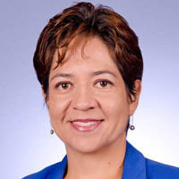
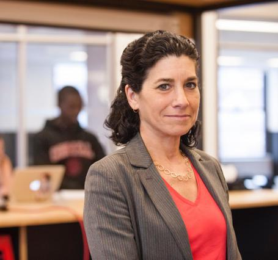
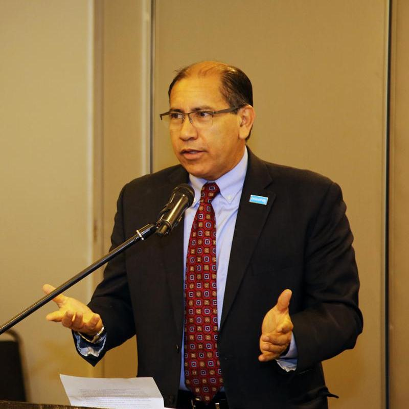
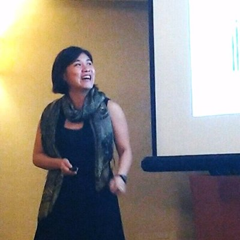
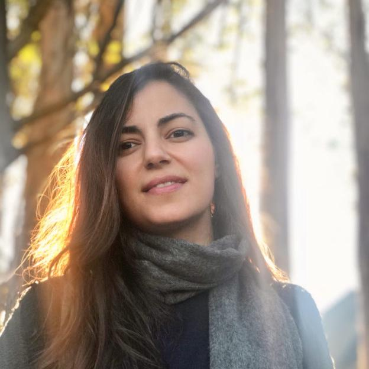

The full program of the workshop will take place on August 17-19, 2020, on Gather.town and Zoom. Please register at [this link](https://docs.google.com/forms/d/e/1FAIpQLSdQsvlXAiQ7qAmGkpWjWkw7h5Gv1AO5_qVZ1PElzbXPq4Y18A/viewform?usp=sf_link) to attend the talks and other events. Note that ET stands for current "New York, USA" time.  
 

## Sunday, August 16

 

| Time | Event | Details |
| --- | --- | --- |
| 12:00-12:00 ET | **Networking Session** (regional meetups) | _Familiarize yourself with the gather.town platform with regional meetups including participants from around the world._ |

 

## Monday, August 17

 

| Time | Event | Authors |
| --- | --- | --- |
| 10:00-10:15 ET | Opening Remarks | Program Chairs: Faidra Monachou and Francisco Marmolejo-Cossío |
| 10:15-11:00 ET | **Keynote:** Maximizing the Social Good: Markets without Money | [Nicole Immorlica](http://www.immorlica.com/), discussants: [Illenin Kondo](https://www.illenin.com/), [Sera Linardi](http://www.linardi.gspia.pitt.edu/) |
| **11:00-11:45 ET** | **Session 1: Education Policy and Diversity** | Session Chair: Bryan Wilder |
| 11:00-11:15 ET | Top Percent Policies and the Return to Postsecondary Selectivity | Zachary Bleemer |
| 11:15-11:25 ET | Unequal Assignment to Public Schools and the Limits of School Choice | Mariana Laverde |
| 11:25-11:35 ET | Who Gets Placed Where and Why? An Empirical Framework for Foster Care Placement | Alejandro Robinson Cortes |
| 11:35-11:45 ET | Explainability in Matching Mechanisms with Diversity Goals: A Case Study of Ethiopian Universities | Basiliyos Betru, Meareg Hailemariam and Rediet Abebe |
| 11:45-12:15 ET | Break |     |
| 12:15-13:00 ET | **Keynote:** How to fight white supremacist extremism while protecting civil liberties: a multidisciplinary approach using technology, research, and policy | [Anjana Rajan](https://www.aspentechpolicyhub.org/team/anjana-rajan/), disscussant: [Roya Pakzad](https://www.royapakzad.co/) |
| **13:10-14:00 ET** | **Session 2: Technology, Law and Policy** | Session Chair: Ana-Andreea Stoica |
| 13:10-13:30 ET | Feminicide & Machine Learning: Detecting Gender-based Violence to Strengthen Civil Sector Activism | Catherine D'Ignazio, Helena Suarez Val, Silvana Fumega, Harini Suresh, Isadora Cruxen, Wonyoung So, Maria De Los Angeles Martinez and Mariel Garcia-Montes |
| 13:30-13:40 ET | The Gender Panopticon: AI, Gender, and Design Justice | Sonia Katyal |
| 13:40-13:50 ET | Privacy as Privilege | Rebecca Wexler |
| 13:50-14:00 ET | "Computer says no!": Unpacking the Human in the Loop Requirement in the Context of Welfare Fraud | Doaa Abu Elyounes |
| 13:30-14:30 ET | Long Break |     |
| **14:30-15:30 ET** | **Session 3: Labor Markets** | Session Chair: Manish Raghavan |
| 14:30-14:45 ET | The Role of Referrals in Inequality, Immobility, and Inefficiency in Labor Markets | Lukas Bolte, Nicole Immorlica and Matthew Jackson |
| 14:45-15:00 ET | All Things Equal? Social Networks as a Mechanism for Discrimination | Chika Okafor |
| 15:00-15:10 ET | Outside Options, Bargaining, and Wages: Evidence from Coworker Networks | Sydnee Caldwell and Nikolaj Harmon |
| 15:10-15:20 ET | The Geography of Unemployment | Adrien Bilal |
| 15:20-15:30 ET | Location Sorting and Endogenous Amenities: Evidence from Amsterdam | Milena Almagro and Tomas Dominguez-Iino |
| **15:30-16:15 ET** | [**Poster Session**](/workshop/md4sg20/posters) | [Vote now for your favorite poster.](https://forms.gle/bfUDZQ4K1zKMXLHr7) |
| **16:15-17:00 ET** | **Networking Session and WGs tables:** | Chinasa T. Okolo (Developing Nations WG), Wanyi Li & Lily Xu (Environment WG), Anson Kahng (Civic Participation WG), Richard Phillips (Inequality & Education WG), Jessie Finocchiaro (Bias/Fairness WG), Sera Linardi (Bridging research & practice) |

 

## Tuesday, August 18

 

| Time | Event | Authors |
| --- | --- | --- |
| 10:00-10:45 ET | **Keynote:** Tech in Support of Caregiving: Innovation Opportunities and Ecosystem Challenges | [Deborah Estrin](https://destrin.smalldata.io/), discussant: [Jon Kleinberg](http://www.cs.cornell.edu/home/kleinber/) |
| **10:45-11:20 ET** | **Session 4: Environment, Agriculture and Food Consumption** | Session Chair: Lily Xu |
| 10:45-11:00 ET | Improving Farmers' Income on Online Agri-platforms: Theory and Field Implementation of a Two-stage Auction | Retsef Levi, Manoj Rajan, Somya Singhvi and Yanchong Zheng |
| 11:00-11:10 ET | Optimal Interventions for Increasing Healthy Food Consumption Among Low-Income Populations | Elisabeth Paulson, Retsef Levi and Georgia Perakis |
| 11:10-11:20 ET | Simple and Approximately Optimal Contracts for Payment for Ecosystem Services | Wanyi Li, Irene Lo and Itai Ashlagi |
| 11:20-12:00 ET | Long Break |     |
| 12:00-12:45 ET | **Keynote** | [Natalia Aríza Ramirez](https://clas.berkeley.edu/visiting-scholar-natalia-ariza-ramirez), discussant: [Juan Felipe Penagos](https://www.linkedin.com/in/jfpenagos/?originalSubdomain=co) |
| **12:45-13:25 ET** | **Session 5: Education in Practice** | Session Chair: Rediet Abebe |
| 12:45-13:00 ET | School Choice in Chile | Natalie Epstein, Jose Correa, Rafael Epstein, Juan Escobar, Ignacio Rios, Nicolas Aramayo, Bastian Bahamondes, Carlos Bonet, Martin Castillo Quintana, Andrés Cristi, Boris Epstein and Felipe Subiabre |
| 13:00-13:15 ET | Competition under Social Interactions and the Design of Education Policies | Claudia Allende |
| 13:15-13:25 ET | From Pipeline to Pipelines: How Multiple Definitions of CS Education Distort CS Enrollment Data | Stephanie Tena-Meza, Aj Alvero and Miroslav Suzara |
| 13:25-14:00 ET | Long Break |     |
| 14:00-15:00 ET | **Panel Discussion (in Spanish, with live captioning)** | [Natalia Aríza Ramirez](https://clas.berkeley.edu/visiting-scholar-natalia-ariza-ramirez), [José R. Correa](https://www.dii.uchile.cl/~jcorrea/), [Rafael Obregón](https://www.who.int/ihr/procedures/zika-ec-biographies/en/index16.html) |
| **15:00-16:00 ET** | **Session 6: Healthcare** | Session Chair: Matt Weinberg |
| 15:00-15:15 ET | Large-scale clinical trial of an AI-augmented intervention for HIV prevention in youth experiencing homelessness | Bryan Wilder, Laura Onasch-Vera, Graham Diguiseppi, Robin Petering, Chyna Hill, Amulya Yadav, Eric Rice and Milind Tambe |
| 15:15-15:30 ET | Heterogeneous Donor Circles for Fair Liver Transplant Allocation | Shubham Akshat, Sommer Gentry and S. Raghavan |
| 15:30-15:40 ET | Predicting no-show appointments in a pediatric hospital in Chile using machine learning | Hector Ramirez, Fabian Villena Rodriguez, Jocelyn Dunstan, Victor Riquelme, Juan Pablo Hoyos, Javier Madariaga and Juan Peypouquet |
| 15:40-15:50 ET | Socioeconomic Network Heterogeneity and Pandemic Policy Response | Mohammad Akbarpour, Cody Cook, Aude Marzuoli, Simon Mongey, Abhishek Nagaraj, Matteo Saccarola, Pietro Tebaldi, Shoshana Vasserman and Hanbin Yang |
| 15:50-16:00 ET | The Consequences of Medicare Pricing: An Explanation of Treatment Choice | Elena Falcettoni |
| **16:00-17:00 ET** | **Networking Session** | Michelle González Amador (Desigualdad, en español), Marc Juarez & Lily Hu (Sesgo algorítmico, en español), Roya Pakzad (Human rights), Tejúmádé Àfòjá (Developing Nations), Wanyi Li & Lily Xu (Environment WG), Paul Gölz (Civic participation WG), Sam Taggart (Inequality WG), Duncan McElfresh (Bias/Fairness WG), Sara Kingsley & George R. Obaido (Data Economies WG) |

 

## Wednesday, August 19

 

| Time | Event | Authors |
| --- | --- | --- |
| 10:15-11:00 ET | **Keynote**: Community, Craft, and the Vernacular in Artificial Intelligence | [Stephanie Dinkins](https://www.stephaniedinkins.com/), discussant: [Manuel Sabin](https://people.eecs.berkeley.edu/~msabin/) |
| **11:00-11:45 ET** | **Session 7: Fairness and Inequality** | Session Chair: Jessica Finocchiaro |
| 11:00-11:15 ET | Measuring Non-Expert Comprehension of Machine Learning Fairness Metrics | Debjani Saha, Candice Schumann, Duncan C. McElfresh, John P. Dickerson, Michelle L. Mazurek and Michael Carl Tschantz |
| 11:15-11:25 ET | Pipeline Interventions | Eshwar Ram Arunachaleswaran, Sampath Kannan, Aaron Roth and Juba Ziani |
| 11:25-11:35 ET | Pricing with Fairness | Maxime Cohen, Adam Elmachtoub and Xiao Lei |
| 11:35-11:45 ET | Public Transit Access and Income Segregation | Prottoy Akbar |
| **11:45-12:45 ET** | [**Poster Session**](/workshop/md4sg20/posters) | [Vote now for your favorite poster.](https://forms.gle/bfUDZQ4K1zKMXLHr7) |
| **12:45-13:30 ET** | **Session 8: Algorithms for Policy and Governance** | Session Chair: Kira Goldner |
| 12:45-13:00 ET | Modeling Assumptions Clash with the Real World: Configuring Student Assignment Algorithms to Serve Community Needs | Samantha Robertson, Tonya Nguyen and Niloufar Salehi |
| 13:00-13:10 ET | The AI Economist: Improving Equality and Productivity with AI-Driven Tax Policies | Stephan Zheng, Alex Trott, Sunil Srinivasa, Nikhil Naik, Melvin Gruesbeck, David Parkes and Richard Socher |
| 13:10-13:20 ET | (Machine) Learning what Governments Value | Daniel Bjorkegren, Joshua Blumenstock and Samsun Knight |
| 13:20-13:30 ET | Economic Method, Digital Platform: When Mechanism Design Moves Online | Salome Viljoen, Jake Goldenfein and Lee McGuigan |
| **13:30 - 14:15 ET** | **Session 9: Online Platforms and Civic Participation** | Session Chair: Daniel Freund |
| 13:30-13:45 ET | Advertising for Demographically Fair Outcomes | Lodewijk Gelauff, Ashish Goel, Kamesh Munagala and Sravya Yandamuri |
| 13:45-13:55 ET | Neutralizing Self-Selection Bias in Sampling for Sortition | Bailey Flanigan, Paul Gölz, Anupam Gupta and Ariel Procaccia |
| 13:55-14:05 ET | Auditing Digital Platforms for Discrimination in Economic Opportunity Advertising | Sara Kingsley, Clara Wang, Alexandra Mikhalenko, Proteeti Sinha and Chinmay Kulkarni |
| 14:05-14:15 ET | Online Policies for Efficient Volunteer Crowdsourcing | Vahideh Manshadi and Scott Rodilitz |
| 14:15-14:45 ET | Long Break |     |
| **14:45-15:25 ET** | **Session 10: Information** | Session Chair: Sam Taggart |
| 14:45-14:55 ET | Information Design for Congested Social Services: Optimal Need-Based Persuasion | Jerry Anunrojwong, Krishnamurthy Iyer and Vahideh Manshadi |
| 14:55-15:05 ET | How to get-toilet-paper.com? Provision of Information as a Public Good | Robizon Khubulashvili, Mallory Avery, Kristi Bushman, Alexandros Labrinidis, Sera Linardi and Konstantinos Pelechrinis |
| 15:05-15:15 ET | Responsible Sourcing: The First Step Is the Hardest | Pia Ramchandrani, Hamsa Bastani and Ken Moon |
| 15:15-15:25 ET | Anticipation and Consumption | Neil Thakral and Linh To |
| 15:25-15:40 ET | Closing Remarks & Award Announcements | Faidra Monachou and Francisco Marmolejo-Cossío |
| **15:40-17:00 ET** | **Closing Reception (Lobby @ Gather.town)** |     |

# Keynote Speakers & Panelists

- - -

*   [Natalia Ariza Ramírez](https://clas.berkeley.edu/visiting-scholar-natalia-ariza-ramirez), National University of Colombia and former Vice Minister of Education in Colombia
*   [José R. Correa](https://www.dii.uchile.cl/~jcorrea/), Professor at Universidad de Chile
*   [Stephanie Dinkins](https://www.stephaniedinkins.com/), Artist Fellow at the Berggruen Institute
*   [Deborah Estrin](https://destrin.smalldata.io/), Associate Dean for Impact at Cornell Tech
*   [Nicole Immorlica](http://www.immorlica.com/), Senior Researcher at Microsoft Research
*   [Rafael Obregón](https://www.who.int/ihr/procedures/zika-ec-biographies/en/index16.html), UNICEF Paraguay
*   [Anjana Rajan](https://www.aspentechpolicyhub.org/team/anjana-rajan/), Chief Technology Officer at Polaris

  

# Discussants

- - -

*   [Jon Kleinberg](http://www.cs.cornell.edu/home/kleinber/), Tisch University Professor at Cornell University
*   [Illenin Kondo](https://www.illenin.com/), Assistant Professor of Economics at the University of Notre Dame
*   [Sera Linardi](http://www.linardi.gspia.pitt.edu/), Associate Professor of Economics at University of Pittsburgh
*   [Roya Pakzad](https://www.royapakzad.co/), founder and director of [Taraaz](https://taraazresearch.org/)
*   [Juan Felipe Penagos](https://www.linkedin.com/in/jfpenagos/?originalSubdomain=co), Universidad de los Andes
*   [Manuel Sabin](https://people.eecs.berkeley.edu/~msabin/), Postdoctoral Researcher at Radboud University

  

# Keynote Speaker Bios

- - -

 

## Natalia Ariza-Ramírez, Former Vice Minister of Education in Colombia

- - -

Bio: [Natalia Ariza Ramírez](https://clas.berkeley.edu/visiting-scholar-natalia-ariza-ramirez) is an economist at the National University of Colombia (NUC). She holds a master's degree in Economics Science from NUC with an emphasis on theory and economic policy. Ms. Ariza Ramírez is an expert in the design, execution, monitoring and evaluation of public policies, especially in the education sector, training for work, and employment. She has led the construction of the regulatory and public policy framework of the sectors of work and education over the past 12 years. Ms. Ariza Ramírez served as an independent consultant and Deputy Minister of Higher Education from 2014 to 2016. She has also held management positions in public institutions in Colombia, including the National Apprenticeship Service, Ministry of Labor, Ministry of Social Protection and the National Planning Department. Ms. Ariza Ramírez believes that access to quality education for children and young people is the only way to achieve social cohesion.

  

### Research and Policy challenges in implementing Colombia's "Ser Pilo Paga" Program

## Stephanie Dinkins, Artist Fellow at the Berggruen Institute

- - -

Bio: [Stephanie Dinkins](https://www.stephaniedinkins.com/) is a transmedia artist who creates platforms for dialog about artificial intelligence (AI) as it intersects race, gender, aging, and our future histories. She is particularly driven to work with communities of color to co-create more inclusive, fair and ethical artificial intelligent ecosystems. Dinkins’ art practice employs lens-based practices, emerging technologies and community engagement to confront questions of bias in AI, consciousness, data sovereignty and social equity. Investigations into the contradictory histories, traditions, knowledge bases and philosophies that form/in-form society at large underpin her thought and art production. Dinkins earned an MFA from the Maryland Institute College of Art in 1997 and is an alumna of the Whitney Independent Studies Program. She exhibits and publicly advocates for inclusive AI internationally at a broad spectrum of community, private and institutional venues – by design. Dinkins is a 2019 Creative Capital Grantee as well as a 2018/19 Soros Equality Fellow, Data and Society Research Institute Fellow and 2018 Sundance New Frontiers Story Lab Fellow.

  

### Community, Craft, and the Vernacular in Artificial Intelligence

Community, Craft, and the Vernacular in Artificial Intelligence takes the position that everyone participating in society is an expert in our experiences within the community infrastructures which inform the makeup of artificially intelligent systems. Although we may not be intellectually aware of jargon used in exclusionary contexts, we share the vernacular of who we are as people and a community and the intimate sense that our data is being used by big entities. Afro-now-ism asks us to ground our understanding by taking the imaginary leap of defining ourselves and our communities outside of systemic oppression in order to craft the systems we'd like to see. Stephanie Dinkins uses her practice as an artist. Stephanie Dinkins will use her practice as an artist working with AI to illustrate these ideas.

  
  
 

## Deborah Estrin, Associate Dean for Impact at Cornell Tech

- - -

Bio: [Deborah Estrin](https://destrin.smalldata.io/) is a Professor of Computer Science at Cornell Tech in New York City where she holds The Robert V. Tishman Founder's Chair, serves as the Associate Dean for Impact, and founded the Jacobs Institute's Health Tech Hub. Estrin's research interests include digital health, ubiquitous computing, personalization, and privacy (TEDMED). Most recently, she has joined the growing community of scholars and practitioners engaged in Public Interest Technology. Before joining Cornell University Estrin was the Founding Director of the NSF Center for Embedded Networked Sensing (CENS) at UCLA; pioneering the development of mobile and wireless systems to collect and analyze real time data about the physical world. Estrin co-founded the non-profit startup, Open mHealth and has served on several scientific advisory boards for early stage mobile health startups.

  

### Tech in support of caregiving: innovation opportunities and ecosystem challenges

Caregiving in the home, outside of traditional clinical settings, is a societally-important, yet under-addressed, application domain that is ripe for digital innovation. I will introduce the context of caregiving, example technical opportunities (e.g., precision sensing, mixed reality, conversational agents), and ecosystem challenges (e.g., misaligned incentives in healthcare, commercialization, and research). I will emphasize the centrality of values in design to the framing of technical problems and solutions (e.g., equity, quality of life and work, dignity, privacy) and the need to intentionally make room for innovation framed in terms of Public Interest needs.

  
  
 

## Nicole Immorlica, Senior Researcher at Microsoft Research

- - -

Bio: [Nicole Immorlica](http://www.immorlica.com/)'s research lies broadly within the field of economics and computation. Using tools and modeling concepts from both theoretical computer science and economics, Nicole hopes to explain, predict, and shape behavioral patterns in various online and offline systems, markets, and games. Her areas of specialty include social networks and mechanism design. She currently serves as chair of ACM SIGecom, the professional organization for researchers in her field. Nicole received her Ph.D. from MIT in Cambridge, MA in 2005 and then completed three years of postdocs at both Microsoft Research in Redmond, WA and CWI in Amsterdam, Netherlands before accepting a job as an assistant professor at Northwestern University in Chicago, IL in 2008. She joined the Microsoft Research Northeast Labs in 2012.

  

### Maximizing the Social Good: Markets without Money

To create a truly sustainable world, we need to generate ample resources and allocate them appropriately. In traditional economics, these goals are achieved using money. However, in many settings of particular social significance, monetary transactions are infeasible, be it due to ethical considerations or technological constraints. In this talk, we will discuss alternatives to money and show how to use them to achieve socially-optimal outcomes. In this talk, we will discuss alternatives to money, including information asymmetry and risk, and show how to use them to achieve socially-optimal outcomes. Information asymmetry enables an informed group to influence a decision maker. This can benefit groups with the power to leverage influence. Using this insight, we study the disparate impact of unequal access to influence. Risk helps determine a person's value for a resource: the more someone is willing to risk for something, the more they value it. Using this insight, we propose an algorithm to find a good assignment of students in school choice programs

  
  
 

## Anjana Rajan, Chief Technology Officer of Polaris

- - -

Bio: [Anjana Rajan](https://www.aspentechpolicyhub.org/team/anjana-rajan/) is the Chief Technology Officer of Polaris, an NGO that uses data-driven strategies to disrupt and prevent human trafficking and modern slavery. She is a seasoned executive and entrepreneur whose expertise is applying technology to human rights and national security issues. Anjana is the former CTO of Callisto, a nonprofit that builds cryptographically-advanced technology to combat sexual assault. Recently, Anjana was a Tech Policy Fellow at the Aspen Institute, where she created privacy-preserving methods to eradicate mass gun violence caused by white supremacist terrorists. Previously, she spent several years in London working at Palantir Technologies building big data platforms for international clients. Anjana was a Knight Scholar at Cornell University and received her bachelor’s and master’s degrees in Operations Research and Information Engineering. Anjana is also a former elite triathlete who raced for Team USA.

 

### How to fight white supremacist extremism while protecting civil liberties: a multidisciplinary approach using technology, research, and policy

Anjana Rajan is the chief technology officer of Polaris, an NGO based in Washington DC that fights human trafficking and modern slavery. Her expertise is applying cryptography to national security and human rights issues. Earlier this year, Anjana was a tech policy fellow at the Aspen Institute, where she focused on answering a central question: how can we create privacy-preserving ways to prevent mass gun violence caused by white supremacist extremists? This problem is challenging because it touches upon many different complex issues: counterterrorism, gun control policy, domestic violence, privacy & civil liberties, and cryptography. In this talk, Anjana will discuss her solution of confidential digital reporting escrows for witnesses to safely report while ensuring the civil liberties of both the witness and suspect are protected. Her talk will elaborate on the cryptographic design of this solution and will underscore the important intersection of technical expertise, research expertise, and policy expertise.

  

# Panelist Bios

- - -

 

## José R. Correa, Professor at Universidad de Chile

- - -

[José R. Correa](https://www.dii.uchile.cl/~jcorrea/) graduated as a Mathematical Engineer from Universidad de Chile in 1999 and obtained a PhD in Operations Research from MIT in 2004. After graduation, he was a postdoctoral associate at the Computer Science Department at Universidad de Chile, and later an assistant professor at the School of Business at Universidad Adolfo Ibáñez. Since 2008, he is faculty at Universidad de Chile where he teaches and conducts research in operations research. His research, focusing in combinatorial optimization and network economics, has been rewarded with the TSL best paper award in 2002 and Tucker prize finalist in 2006. He has given invited talks at several institutions, and has been in the program committee of international computer science conferences, including the Latin American Theoretical Informatics conference (LATIN), the workshop on Approximation and Online Algorithms (WAOA), and the workshop on Internet and Networks Economics (WINE). He also serves as associate editor of one of the leading journals of the field: Operations Research.

  
  
 

## Rafael Obregón, UNICEF Paraguay

- - -

Dr. [Rafael Obregón](https://www.who.int/ihr/procedures/zika-ec-biographies/en/index16.html) provides technical leadership and guidance on the development of standards, guidelines, and quality assurance for the application of communication for development principles and strategies across programmatic areas of the United Nations Children’s Fund (UNICEF), including emergency response and humanitarian action. He has served as Regional Advisor for Health Communication within the Area of Family and Community Health and Child and Adolescent Health Unit at the Pan American Health Organization, Regional Office for the Americas of the World Health Organization (PAHO/WHO). Dr Obregón has also been a technical advisor, researcher and resource/focal person for international/national cooperation agencies and government and non-governmental organizations. His duties have focused on formative research, project design and evaluation, and capacity strengthening. Dr Obregón has also been associate professor and guest faculty member at a number of universities, including Ohio University, United States of America, the Universidad del Norte in Barranquilla, Colombia, and the Universidad Autónoma in Barcelona, Spain.

  
  
  

# Discussants Bios

- - -

 

## Jon Kleinberg, Cornell University

- - -

[Jon Kleinberg](http://www.cs.cornell.edu/home/kleinber/) is the Tisch University Professor in the Departments of Computer Science and Information Science at Cornell University. His research focuses on the interaction of algorithms and networks, the roles they play in large-scale social and information systems, and their broader societal implications. He is a member of the National Academy of Sciences and the National Academy of Engineering, and the recipient of MacArthur, Packard, Simons, Sloan, and Vannevar Bush research fellowships, as well awards including the Harvey Prize, the Nevanlinna Prize, and the ACM Prize in Computing.

  
  
 

## Illenin Kondo, University of Notre Dame

- - -

[Illenin Kondo](https://www.illenin.com/) is an Assistant Professor of Economics at the University of Notre Dame. His research explores both the macroeconomic and the distributional impacts of economic integration. His recent works focus on infrastructure network misallocation, trade-induced job reallocations, and sovereign debt crises. He received his Ph.D. in economics at the University of Minnesota and holds electrical and computer engineering degrees from Georgia Tech and Supélec. Before joining Notre Dame, he worked at the Federal Reserve Board and taught at Johns Hopkins University. He hails from Togo, with roots in Ghana on his mother's side.

  
  
 

## Sera Linardi, University of Pittsburgh

- - -

[Sera Linardi](http://www.linardi.gspia.pitt.edu/) Sera Linardi is an Associate Professor of Economics at the Graduate School of Public and International Affairs (GSPIA) and at the Intelligent Systems Program at the School of Computing and Information at the University of Pittsburgh. She founded and direct the Center for Analytical Approaches to Social Innovation (CAASI), which seeks to connect quantitative social science with practical social innovation. She received her PhD from California Institute of Technology and was a computer scientist at Adobe Systems before graduate school.

  
  
 

## Roya Pakzad, Taraaz

- - -

[Roya Pakzad](https://www.royapakzad.co/) is founder and director of [Taraaz](https://taraazresearch.org/), a research and advocacy organization working at the intersection of technology and human rights. She is also an affiliated scholar at UC Berkeley's CITRIS Policy Lab. Previously, she served as a Research Associate and Project Leader in Technology and Human Rights at Stanford University's Global Digital Policy Incubator (GDPi). She also worked with Stanford's program in Iranian Studies on the role of information and communication technologies and human rights in Iran. Prior to entering the human rights field, she was an electrical engineer at Advanced Micro Devices (AMD). Roya holds degrees from Shahid Beheshti University in Iran (B.Sc. in Electrical Engineering), the University of Southern California (M.Sc. in Electrical Engineering) and Columbia University (M.A. in Human Rights Studies). She was born and raised in Tehran, Iran and currently lives in Santa Cruz, California.

  
  
 

## Juan Felipe Penagos, Universidad de los Andes

- - -

[Juan Felipe Penagos](https://www.linkedin.com/in/jfpenagos/?originalSubdomain=co) is a an Industrial Engineer, MsC in Industrial Engineering, and a soon to be PhD in Industrial Engineering. His resesrch is focused on understanding Complex Social Systems through mathematical modelling and simulation. He has applied these approaches to the Colombian higher education system, leading to the creation of the largest undergraduate scholarship fund (1.2 USD bn) of the Colombian Ministry of Education: the "Ser Pilo Paga" program. Also, these models have been used to pass several pieces of legislation through the Congress of Colombia, to allow the education system and the student loan system become more sustainable and equitable through an Income Contingent Loans Mechanism for Higher Education.

  
  
 

## Manuel Sabin, Radboud University

- - -

[Manuel Sabin](https://people.eecs.berkeley.edu/~msabin/), Postdoctoral Researcher at Radboud University working with lawyers/legal philosophers on the [COHUBICOL](https://www.cohubicol.com/) project. Their work there aims to understand and give language to how new technologies - e.g. Machine Learning-based recidivism prediction, smart contracts, jurimetrics, etc. - affects and, often, undermines the institution of Law. Before this, Manuel received their PhD at UC Berkeley as a Theoretical Computer Scientist advised by Shafi Goldwasser and Christos Papadimitriou. Their work continues to vary from foundational Complexity Theory and Cryptography to analyzing the implicit politics encoded into technology and its socio-technical effects in redistributing power in the world. Manuel is an organizer of the [Radical AI network](https://radicalai.net/) and founded and organized the QTPOC Reclaiming Education and STEM (QTPRES) Conference (Postponed for COVID-19).

# Poster Sessions

- - -

There will be two poster sessions; the first is on Monday, August 17 from ~3-4pm~ 3:30-4:15pm EDT (UTC-4) and the second is on Wednesday August 19 from 11:30am-12:30pm EDT (UTC-4). Below is a list of each poster by day. Some accepted posters will not be presented, and these are listed at the bottom of this page. [Vote now for your favorite poster!](https://forms.gle/bfUDZQ4K1zKMXLHr7)  
  

# Poster Session 1: Monday, August 17, ~3-4pm~ 3:30-4:15pm EDT (UTC-4)

- - -

| Authors | Title | Gather Location   (Row-Column) |
| --- | --- | --- |
| Emilie Jackson | Availability of the Gig Economy and Long Run Labor Supply Effects for the Unemployed | 2-A |
| [Roel Dobbe,](http://thomaskrendlgilbert.com/) [Thomas Krendl Gilbert](http://thomaskrendlgilbert.com/) and Yonatan Mintz | Hard Choices in Artificial Intelligence | 1-C |
| Jonathan Penn, Christina Colclough and Nathan Freitas | WeClock: a self-tracking app to fight wage theft and foster worker wellbeing | 1-G |
| Matthew Jackson, Suraj Malladi and David McAdams | Learning through the Grapevine: the Impact of Message Mutation, Transmission Failure, and Deliberate Bias | 1-F |
| Aj Alvero and Sonia Giebel | Designing for Fairness in a Post-SAT College Admissions Universe | 4-B |
| Devansh Jalota, Marco Pavone and Yinyu Ye | Markets for Efficient Public Good Allocation | 2-C |
| [Anil Aswani](http://aswani.ieor.berkeley.edu/) and Matt Olfat | Optimization Hierarchy for Fair Statistical Decision Problems | 5-D |
| Serena Wang, Wenshuo Guo, Harikrishna Narasimhan, Andrew Cotter, Maya Gupta and Michael Jordan | Robust Optimization for Fairness with Noisy Protected Groups | 5-C |
| Omar Alejandro Pérez-Cruz, Edgard Alfredo Nande-Vázquez and Juan Carlos Martínez-Verdugo | The indebtedness component of state public spending in Mexico. A retrospective analysis of 2012-2016 period | 2-H |
| [Renzhe Yu, Qiujie Li,](http://www.chrisfi.com/) [Christian Fischer](http://www.chrisfi.com/), Shayan Doroudi and Di Xu | Towards Accurate and Fair Prediction of College Success: Evaluating Different Sources of Student Data | 4-E |
| Angela Giraldo | Sustainable business models for peace | 3-H |
| Daniel Ngo, Logan Stapleton, Vasilis Syrgkanis and Zhiwei Steven Wu | Incentivizing Bandit Exploration:Recommendations as Instruments | 5-G |
| [Aradhya Sood](https://sites.google.com/view/aradhyasood) | Land Market Frictions in Developing Countries: Evidence from Manufacturing Firms in India | 3-G |
| [Mauricio Umana](http://linkedin.com/in/mauricioumana), Felipe Perez-Pineda, Pablo Nuño de la Parra, Alfonso Mendoza and Carmen Padilla | Measuring the Impact of Shared Value. A Business Case | 2-D |
| Lan Nguyen | Predicting the Effect of Affirmative Action Plans in New York City Elite Public High Schools | 4-C |
| Yueyang Zhong, Zhixi Wan and Zuo-Jun Max Shen | Queueing Versus Surge Pricing Mechanism: Efficiency, Equity, and Consumer Welfare | 2-E |
| Vegard Nygaard and Elena Falcettoni | A Comparison of Living Standards Across the States of America | 1-A |
| Florian Berlinger, Lily Xu and Yiling Chen | A High-Performance Graph Model for Near-Optimal Payments for Ecosystem Services | 3-B |
| Roberto Navarro and Yaxk'In Ú Kan Coronado | Analysis of agricultural databases for productivity and proper management of water resources in the Mezquital valley region, Mexivo. | 3-D |
| Lok Chan, Kenzie Doyle, Duncan McElfresh, Vincent Conitzer, John P. Dickerson, Jana Schaich Borg and Walter Sinnott-Armstrong | Artificial Artificial Intelligence: Measuring Influence of AI 'Assessments' on Moral Decision-Making | 1-B |
| [Seth Copen Goldstein](http://www.cs.cmu.edu/~seth), Denizalp Goktas, Miles Conn, Shanmukha Phani Teja Pitchuka, Mohammed Sameer, Maya Shah, Colin Swett, Hefei Tu, Shrinath Viswanathan, Jessica Xiao | BoLT: Building on Local Trust to Solve Lending Market Failure | 5-E |
| Kasia Chmielinski and Sarah Newman | Building Healthier Models with Dataset 'Nutrition Labels' | 4-G |
| Maria Camila Acevedo García, Maria Alejandra Franco Montoya, Juan Carlos González Vélez and Giovanny Franco Sepúlveda | Evaluación de un algoritmo de reconocimiento de zonas asociadas a prácticas mineras ilegales en la extracción de oro de aluvión en Colombia utilizando Machine Learning (ML) | 3-E |
| Sean Sinclair, Gauri Jain, Siddhartha Banerjee and Christina Yu | Sequential Fair Allocation of Limited Resources under Stochastic Demands | 2-F |
| [Angela Zheng](https://sites.google.com/nyu.edu/angelazheng) | The Valuation of Local School Quality under School Choice | 4-D |
| Bao Kham Chau, Pranoto Iskandar, Harper Lyon, Lily Pagan and Beth Lyon | Tracking Xenophobic Twitter Speech To Inform (and Shift) Policy | 1-E |
| Lorayne Finol Romero, Cecilia González Jeria and Maximiliano Núñez Gómez | Laboratorio de Derecho y Política Local, propone: Red de Monitoras y Monitores Derecho para Todos | 1-D |
| Juan Virdis, Eugenia Elorza and Fernando Delbianco | Optimal mechanism design for health care systems in developing countries: gatekeeping vs co-payments | 4-H |
| Jorge Regalado | Bytes de generosidad | 4-A |
| [Mamadou Bousso](http://www.univ-thies.sn/), Allé Dieng, Latif Dramani, Alassane Bah | Economical Dependency Evolution and Complexity | 2-G |
| Loyani Loyani, Denis Rubanga and Dina Machuve | A deep learning approach for determining effects of tuta absoluta in tomato plants | 3-A |
| Beston Lufyagila, Dina Machuve and Thomas Clemen | A Secure IoT Based System for Environmental Conditions Monitoring in Poultry House Using Multi-Factor Authentication | 3-C |
| Tom Ron, Omer Ben-Porat and Uri Shalit | Corporate Social Responsibility via Multi-Armed Bandits | 5-F |
| Hope Mbelwa and Dina Machuve | Image based poultry disease detection using deep convolution nerual network | 3-F |
| [Emil Temnyalov](https://sites.google.com/site/temnyalov/) | An economic theory of differential treatment | 5-A |
| Randall Ratana, Hamid Sharifzadeh and Jamuna Krishnan | A New Zealand Experience: Considerations of Data Collection in Māori Population for Automatic Detection of Schizophrenia using NLP | 4-F |
| Darshan Chakrabarti, Jie Gao, Aditya Saraf, Grant Schoenebeck and Fang-Yi Yu | Optimal Local Bayesian Differential Privacy over Markov Chains | 1-H |
| Steven Yin, Shatian Wang, Lingyi Zhang and Christian Kroer | Dominant Resource Fairness with Meta Types | 5-B |
| [Hadi Hosseini](https://www.cs.rit.edu/~hho/), Andrew Searns and Sawyer Welden | Guaranteeing Maximin Shares: Some Agents Left Behind | 2-B |

 

# Poster Session 2: Wednesday, August 19, 11:30am-12:30pm EDT (UTC-4)

- - -

| Authors | Title | Gather Location   (Row-Column) |
| --- | --- | --- |
| [Angela Zheng](https://sites.google.com/nyu.edu/angelazheng) | The Valuation of Local School Quality under School Choice | 1-A |
| [Gireeja Ranade](http://eecs.berkeley.edu/~gireeja), Swati Gupta, Akhil Jalan, Helen Yang and Simon Zhuang | Approximately optimal solutions for multiple fairness metrics: A case study | 3-H |
| [Sritej Attaluri](http://sritej.com/) and Sarah Scheffler | Proposing Safeguards for Governmentally-Regulated Risk-Assessment Mechanisms | 1-C |
| Emily Aiken, Guadalupe Bedoya, Aidan Coville and Joshua Blumenstock | Targeting Humanitarian Response with Machine Learning and Mobile Phone Data | 1-F |
| Katya Klinova, B Cavello and Nicholas Anway | What's the responsibility of the AI industry in ensuring that AI serves to create an inclusive global economy? | 1-G |
| Marcela Lopez and Juan Manuel Lozano de Poo | Citizen Science and Community Planning: a Socio-environmental Study to Regenerate the Paisanos River in San Luis Potosí | 3-A |
| Jad Salem and Swati Gupta | Closing the GAP: Group-Aware Parallelization for the Secretary Problem with Biased Evaluations | 5-B |
| [Wanyi Li](http://wanyi.li/), Nicole Immorlica and Brendan Lucier | Contract Design for Afforestation Programs | 3-B |
| [Krishna Dasaratha](https://sites.google.com/site/krishnadasaratha/research) | Distributions of Centrality on Networks | 4-F |
| [Diana MacDonald](http://www.dianamacdonald.com/) | Foster Care: A Dynamic Matching Approach | 2-A |
| Candice Schumann, Zhi Zhang, Nicholas Mattei and John P. Dickerson | Group Fairness in Bandits with Biased Feedback | 5-C |
| [Yahav Bechavod](https://www.cs.huji.ac.il/~yahav_be/), [Christopher Jung](https://www.cis.upenn.edu/~chrjung/) and [Z. Steven Wu](http://zstevenwu.com/) | Metric-Free Individual Fairness in Online Learning | 5-D |
| Hao-Fei Cheng, Paige Bullock, Alexandra Chouldechova, Z. Steven Wu and Haiyi Zhu | Soliciting Stakeholders’ Fairness Notions in Child Maltreatment Predictive Systems | 4-C |
| Krystal Maughan and Joe Near | Towards a Measure of Individual Fairness for Deep Learning | 4-D |
| [Gerard Olivar-Tost](https://www.researchgate.net/profile/Gerard_Olivar_Tost) | Mathematical Modeling for Sustainability | 3-D |
| [Stefano Caria, Grant Gordon, Maximilian Kasy, Simon Quinn, Soha Shami and](http://t8el.com/) [Alexander Teytelboym](http://t8el.com/) | An Adaptive Targeted Field Experiment: Job Search Assistance for Refugees in Jordan | 4-E |
| Lauren Pak | Right to the City: AI for Consumption or Connection? | 1-E |
| Abhishek Gupta, Camylle Lanteigne and Sara Kingsley | SECure: A Social and Environmental Certificate for AI Systems | 3-G |
| [Masoomali Fatehkia, Isabelle Tingzon, Ardie Orden, Stephanie Sy, Vedran Sekara, Manuel Garcia Herranz and](http://www.qcri.qa/our-people/bio?pid=67) [Ingmar Weber](http://www.qcri.qa/our-people/bio?pid=67) | Mapping Socioeconomic Indicators Using Social Media Advertising Data | 4-G |
| [Meike Zehlike](http://meikezehlike.de/), Philipp Hacker and Emil Wiedemann | Matching code and law: achieving algorithmic fairness with optimal transport | 4-B |
| [Joao Palotti, Natalia Adler, Alfredo Moralez-Guzman, Jeffrey Villaveces, Vedran Sekara, Manuel Garcia Herranz, Musa Al-Asad and](http://www.qcri.qa/our-people/bio?pid=67) [Ingmar Weber](http://www.qcri.qa/our-people/bio?pid=67) | Monitoring of the Venezuelan exodus through Facebook's advertising platform | 4-H |
| Emil Chrisander and Andreas Bjerre-Nielsen | Prediction Policy for Matching Mechanisms: The Case of School Choice | 1-H |
| Niklas Eder | Privacy, Non-Discrimination and Equal Treatment — Developing a Fundamental Rights Response to Behavioural Profiling | 2-E |
| Francesco Fabbri, Francesco Bonchi, Ludovico Boratto and Carlos Castillo | The Effect of Homophily on Disparate Visibility of Minorities in People Recommender Systems | 2-F |
| Zsolt Bihary, Péter Csóka, Péter Kerényi and Alexander Szimayer | Vulnerability and self-respect in the gig economy: A dynamic principal-agent model | 2-C |
| [Yiannis Kanellopoulos](http://www.code4thought.eu/) and Christos Aridas | PyThia: A Reporting Tool on Bias Evaluation and Mitigation | 1-D |
| Stratis Tsirtsis and Manuel Gomez Rodriguez | Decisions, Counterfactual Explanations and Strategic Behavior | 2-G |
| Daniel Mutembesa, Ernest Mwebaze, Solomon Nsumba and Chris Omongo | Implementation Lessons and Farmer Perspectives; A Case of Low-Cost Crop Sensing at Scale with Smallholder Farmers in a Developing Country. | 3-C |
| [Daniel Mutembesa](http://www.air.ug/) | Routing Motorcycle Taxis Participating in Low-Cost Mobile Air Quality Sensing Campaigns in a Developing Country. | 3-F |
| Sahil Deo, Sanjana Krishnan and Neha Sontakke | Operationalizing algorithmic explainability in the context of risk profiling done by robo financial advisory apps. |     |
| [Jerry Anunrojwong](https://jerryanunroj.github.io/), Ozan Candogan and Nicole Immorlica | Social Learning Under Platform Influence: Extreme Consensus and Persistent Disagreement | 5-A |
| Lyantoniette Chua | A matter of life and death: Social Media, Regimes, and the Global South The Philippines - a case in point | 1-B |
| Edith Elkind, Neel Patel, Alan Tsang and Yair Zick | Keeping Your Friends Close: Land Allocation with Friends | 2-B |
| Grant Schoenebeck, Chenkai Yu and Fang-Yi Yu | Timely Information from Prediction Markets | 2-H |
| Gabriel Valverde | Micro houses and shelters | 3-E |
| Angie Peng, Jeff Naecker, Ben Hutchinson, Andrew Smart and Nyalleng Moorosi | Fairness Preferences, Actual and Hypothetical: A Study of Crowdworker Incentives | 4-A |

  

# Accepted posters, not presented

- - -

| Authors | Title |
| --- | --- |
| Mehmet Ahsen, Mehmet Ayvaci and Srinivasan Raghunathan | When algorithmic predictions use human-generated data: A bias-aware classification algorithm for breast cancer diagnosis |
| Josue Ortega, Robert Aue and Thilo Klein | What Happens when Separate and Unequal School Districts Merge? |
| Tomas Larroucau and Ignacio Rios | Dynamic College Admissions and the Determinants of Students' Persistence |