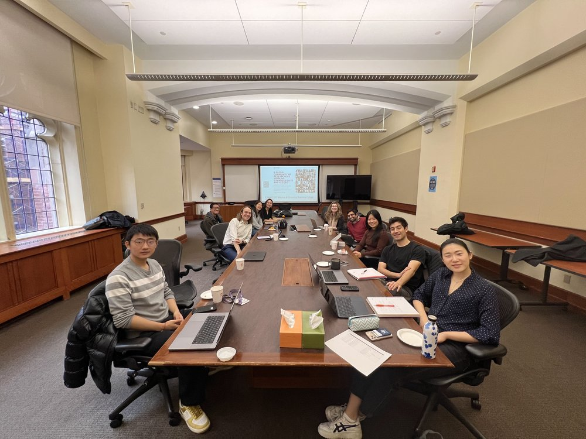

The EAAMO’s Executive Director [Sera Linardi](https://www.linardi.gspia.pitt.edu/), [Augustin Chaintreau](https://www.engineering.columbia.edu/faculty-staff/directory/augustin-chaintreau), [Gabriel Agostini](https://infosci.cornell.edu/content/agostini), and [Renzhe Yu](https://www.tc.columbia.edu/faculty/ry2454/) led the organization of NYC series of meetups that took place on November 7, 2024, December 12, 2024, January 31, 2025, and one to be in May 19, 2025. 

These gatherings brought together researchers, practitioners, and advocates to explore interdisciplinary topics at the intersection of equity, access, and computational tools. Featured participants included Matt Franchi, Ian Solano-Kamaiko, and Nikhil Garg, who contributed to vibrant discussions on innovative approaches to tackling societal challenges. The meetups created a collaborative space for exchanging ideas and building partnerships, further strengthening the local EAAMO community in New York City.

Please find some photos from these events below:

#### Schapiro Center for Engineering, Columbia. Nov 7 2024. Host: Augustin Chaintreau (Columbia CS)

#### Bloomberg, Cornell Tech, Dec 12 2024. Hosts: Gabriel Agnosti, Matt Franchi (EAAMO Urban Data Science Working Group), Ian Solano-Kamaiko, Nikhil Garg, Sera Linardi (Cornell Tech)

#### Columbia's Teacher's College. Jan 30 2025. Hosts: Renzhe Yu & Chengyuan Yao (Teacher's College)

