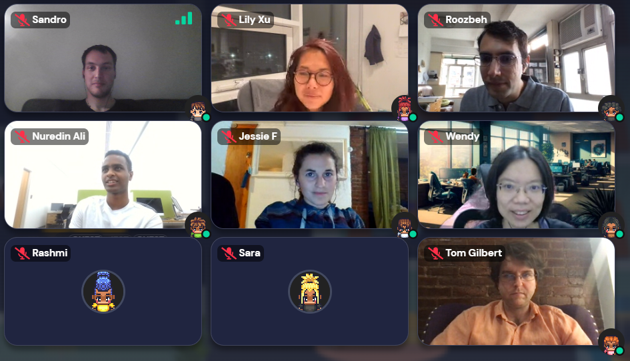

The wonderful team at Virtual Chair has designed a meeting space specifically for the MD4SG community on Gather.town as part of their growing Academic Metaverse.

We had a global representation at the meetup, with people from the United States, Europe, and Asia. As always, MD4SG welcomes people from across the globe, regardless of whether they are veteran working group members or new to the MD4SG community. At the meetup, we discussed PhD programs and applying to PhD studies, publication at conferences, the cultural differences between different areas, and work-life balance.

