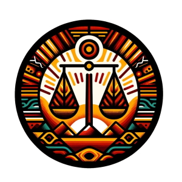

[Version in English](working_groups/lac)

El Grupo de Trabajo sobre Equidad y Justicia para las Comunidades Indígenas en las Américas (EJUCIAM) es una iniciativa enfocada en abordar las desigualdades históricas y sistémicas enfrentadas por los pueblos indígenas en toda la región. Este esfuerzo colaborativo reúne a investigadores, miembros de comunidades indígenas,  activistas y líderes comunitarios para formular políticas, estrategias y programas que promuevan la equidad, el acceso a recursos y la protección de derechos para las comunidades indígenas. Al enfocarse en temas críticos como los derechos sobre la tierra, la educación, la atención médica y la preservación cultural entre otros, el grupo de trabajo busca desmantelar barreras y abogar por un desarrollo inclusivo que respete e integre el conocimiento y las tradiciones indígenas. A través del diálogo, la investigación y la defensa, este grupo se esfuerza por crear una sociedad más equitativa y justa, donde las voces de los pueblos indígenas sean escuchadas, respetadas e integradas en el tejido nacional de los países americanos.

## Verano de las Ciencias Indígena MD4SG:
El grupo de trabajo EJUCIAM es una extensión del programa Verano de las Ciencias Indígena de MD4SG dentro del cual se apoya a mujeres estudiantes de diversas comunidades indígenas en México en el diseño y ejecución de proyectos de investigación dirigidos a mejorar sus comunidades. En los últimos dos años del Verano de las Ciencias hemos apoyado a más de 20 investigadoras indígenas de 11 comunidades indígenas (Cuanajo, Purépecha, Mixteco, Tepehuán, Rarámuri, Mazahua, Zapoteca, Náhuatl, Tének, Mazateca y Zoque). 

## Estructura:
El grupo EJUCIAM se reúne virtualmente cada 2 semanas en zoom. En nuestras reuniones compartimos y discutimos trabajo relevante para comunidades indígenas en las Américas (generalmente en Español), ya sea de parte de los integrantes de nuestro grupo o por pláticas invitadas.

## Relevant Themes:
- Derechos Humanos
- Educacion
- Salud Publica
- Preservacion Cultural
- Conservación Medioambiental

## Cómo unirse a EJUCIAM:
Si está interesado/a/e en unirse a EJUCIAM y nuestras iniciativas más amplias en torno a comunidades indígenas, no dude en comunicarse con los organizadores de nuestro grupo de trabajo o completar este formulario: https://forms.gle/7eE1dAoeJ1wMPmri9

## Organizadoras
||||
|--- |--- |--- |
|[Flor ángel Pérez Sánchez](https://www.uv.mx/citro/)|Estudiante de Maestría en Ecología Tropical|CITRO|
|[Yésica Gómez Hernández](https://uatx.mx/)|Estudiante de Doctorado en Investigación Educativa|UATx|

## Asesor Académico
||||
|--- |--- |--- |
|[Francisco Marmolejo Cossío](https://www.fmarmolejo.com/)|Investigador Postdoctoral|Harvard University|
|[Michelle González Amador](https://www.m-gonzalezamador.com/)|Investigador Postdoctoral|Wageningen University & Research|

## Miembros del Grupo de Trabajo
||||
|--- |--- |--- |
|Adriana Santiago Marcelino|Maestría en Derechos Humanos|UASLP|
|Alma Benita Cruz González|Estudiante de Maestría en Medicina Social|UAM|
|Anai Domingo Martínez|Estudiante de Maestría en Salud Pública|UASLP|
|Argelia Contreras Aguirre|Estudiante de Maestría en Educación Intercultural|UPNECH|
|Celeste Cristal Flores Cuevas|Maestría en Gestión Sustentable del Agua|COLSAN|
|Claudia Martínez Martínez|Estudiante de Maestría en Relaciones Internacionales|UANL|
|Edna Marlene Martínez Hernández|Estudiante de Maestría en Ciencias en Salud Pública|UANL|
|Idalia Rojas Martínez|Licenciada en Enfermería con Orientación en Obstetricia|UASLP|
|[Imelda Flores Vazquez](https://www.linkedin.com/in/dr-imelda-flores-vazquez-1a3262171/)|Economista Principal|Econometrica Inc.|
|Iridiana Salinas Hernández|Estudiante de Maestría en Contaduría|UANL|
|Leydi Rojas Martínez|Estudiante de Maestría en Ciencias en Salud Pública|UANL|
|María del Rosario Félix Gaspar|Maestría en Enfermería Perinatal|UAEM|
|María Guadalupe García Alonso|Estudiante de Maestría en Ciencias en Desarrollo Rural|UACh|
|María Guadalupe Márquez Hinojosa|Estudiante de Maestría en Salud Pública|UASLP|
|María Rosario Niniz Silva|Estudiante de doctorado en Ciencias Sociales en Estudios Rurales|UASLP|
|María Teresa Santiago Marcelino|Maestría en Derechos Humanos|UASLP|
|Nancy Santiago Santos|Licenciatura en Arquitectura|UASLP|
|Ofelia López Mejía|Estudiante de posdoctorado en Ciencias del Derecho|UAS|
|[Paula Rodríguez Díaz](https://paularodrid.wordpress.com/)|Estudiante de Doctorado|Harvard University|
|Rosa Adriana Rivas Castillo|Licenciatura en Psicología Social Comunitaria|UAIM|
|[Ruben Martínez Cárdenas](https://rubenmtzc.netlify.app/)|Lecturer|University of York|
|[Tilsa Oré Mónago](https://profiles.rice.edu/faculty/tilsa-ore-monago)|Lecturer|Rice University|
|Viridiana Camacho Pánfilo|Doctorado en Historia|Instituto Mora|
|Xóchitl Rosales Terán|Licenciatura en Derecho|UASLP|
|Yazmin Cruz Cruz|Estudiante de Maestría en Ingeniería Administrativa|TNM|
