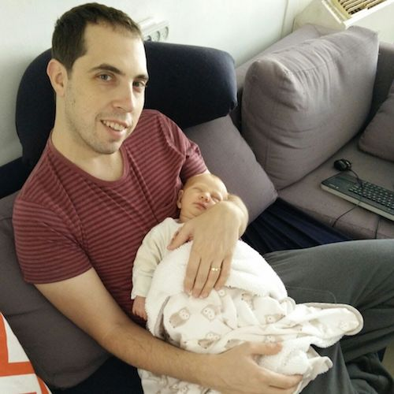

The Mechanism Design for Social Good research group is a multi-institution, interdisciplinary group exploring research directions in various domains where insights from algorithms, optimization, and mechanism design can be used to improve access to opportunity.

We keep this website updated with our reading list and detailed discussion notes. The notes are taken by members of the group with some figures and texts taken from the accompanying presentations and papers. The organizers take responsibility for these notes. 

| Section | Date | Topic | Suggested Reading | Speaker | Notes |
| --- | --- | --- | --- | --- | --- |
| Developing World (Rediet) | 11/27/17 | Kudu: An Electronic Market for Agricultural Trade in Uganda | 1.  [About Kudu](http://kudu.ug/about/) 2.  [Designing and Evolving an Electronic Agricultural Marketplace in Uganda](http://www.cs.ubc.ca/~newmanne/papers/kudu.pdf) | [Kevin Leyton-Brown](http://www.cs.ubc.ca/~kevinlb/) | [PDF](notes/DevWorld1.pdf) |
| Developing World (Rediet) | 3/27/18 | Sensing with Farmers | 1.  [AI and Data Science Group](http://www.air.ug/) 2.  [mCROPS project](http://air.ug/mcrops) | [Mutembesa Daniel](http://air.ug/mcrops/people.html), with [Ernest Mwebaze](http://air.ug/~emwebaze/) | [PDF](notes/DevWorld2.pdf) |
| Developing World (Rediet) | 4/17/18 | Land Trade and Development | 1.  [Land Trade and Development](https://papers.ssrn.com/sol3/papers.cfm?abstract_id=3003913) | [Gharad Bryan](https://sites.google.com/site/gharadbryan/) | [PDF](notes/DevWorld3.pdf) |
| Developing World (Rediet) | 5/1/18 | Give Directly | 1.  [Give Directly Website](https://www.givedirectly.org/) | [Paul Niehaus](http://econweb.ucsd.edu/~pniehaus/) | [PDF](notes/DevWorld4.pdf) |
| Developing World (Rediet) | 5/8/18 | Information and Communication Technology for Development | 1.  [UW ICTD Lab](https://ictd.cs.washington.edu/) 2.  [BSpeak: An Accessible Crowdsourcing Marketplace for Blind People](http://www.adityavashistha.com/uploads/2/0/8/0/20800650/bspeak_chi_2018.pdf) 3.  ["You Can Always Do Better!" The Impact of Social Proof on Participant Response Bias](http://www.adityavashistha.com/uploads/2/0/8/0/20800650/social_influence_chi_2018.pdf) | [Aditya Vashistha](http://www.adityavashistha.com/) | [PDF](notes/MDSGPresentation.pdf) |
| Civic Participation (Sam) | 2/20/18 | Participatory Budgeting |     | [Ashish Goel](https://web.stanford.edu/~ashishg/) | [PDF](notes/civicparticipation1.pdf) |
| Civic Participation (Sam) | 3/6/18 | Voter Fraud | 1.  [One Person, One Vote: Estimating the Prevalence of Double Voting in U.S. Presidential Elections](https://5harad.com/papers/1p1v.pdf) | [Sharad Goel](https://5harad.com/) | [PDF](notes/civicparticipation2.pdf) |
| Civic Participation (Sam) | 3/13/18 | Extreme Democracy | 1.  [Liquid Democracy: An Algorithmic Perspective](http://procaccia.info/papers/liquid.pdf) 2.  [Preference Elicitation For Participatory Budgeting](http://procaccia.info/papers/pb.pdf) 3.  [A Voting-Based System for Ethical Decision Making](http://procaccia.info/papers/ethics.pdf) | [Ariel Procaccia](http://procaccia.info/) | [PDF](notes/civicparticipation3.pdf) |
| \*Special Talk\* | 1/23/18 | Privacy and Poverty | 1.  [The Class Differential in Privacy Law](https://papers.ssrn.com/sol3/papers.cfm?abstract_id=2182773) 2.  [Social Media, Privacy, and Personal Responsibility Among Low-SES Youth](http://journals.sagepub.com/doi/abs/10.1177/2056305117710455) 3.  [The Personal Prospectus and the Threat of a Full Disclosure Future](https://scholarlycommons.law.northwestern.edu/cgi/viewcontent.cgi?referer=https://www.google.com/&httpsredir=1&article=1157&context=nulr) | [Rachel Cummings](http://pwp.gatech.edu/rachel-cummings/) | [PDF](notes/privacy1.pdf) |
| Bias and Diversity (Manish) | 10/2/17 | Designing Against Discrimination in Online Markets | 1.  [Preprint](https://papers.ssrn.com/sol3/papers.cfm?abstract_id=3084502) | [Solon Barocas](http://solon.barocas.org/) | [PDF](notes/biasanddiversity1.pdf) |
| Bias and Diversity (Manish) | 10/16/17 | Group Fairness in a Two-Stage Labor Market | 1.  [Fairness at Equilibrium in the Labor Market](https://arxiv.org/abs/1707.01590) | [Lily Hu](https://scholar.harvard.edu/lilyhu/) | [PDF](notes/biasanddiversity2.pdf) |
| Bias and Diversity (Manish) | 10/30/17 | Affirmative Action | 1.  [Valuing Diversity](https://www.brown.edu/Departments/Economics/Faculty/Glenn_Loury/louryhomepage/cvandbio/Fryer-Loury-JPE-Final.pdf) | [Glenn Loury](https://www.brown.edu/Departments/Economics/Faculty/Glenn_Loury/louryhomepage/) | [PDF](notes/biasanddiversity3.pdf) |
| Education (Irene) | 5/3/17 | Mechanism Design and Allocation Systems | Course Allocation at Wharton  1.  [The Combinatorial Assignment Problem: Approximate Competitive Equilibrium from Equal Incomes](http://faculty.chicagobooth.edu/eric.budish/research/budish-approxceei-jpe-2011.pdf) 2.  [Bringing Real Market Participants: Real Preferences into the Lab: An Experiment that Changed the Course Allocation Mechanism at Wharton](https://ideas.repec.org/p/ess/wpaper/id11135.html) 3.  [Course Match: A Large-Scale Implementation of Approximate Competitive Equilibrium from Equal Incomes for Combinatorial Allocation](http://pubsonline.informs.org/doi/abs/10.1287/opre.2016.1544)  School Choice in Boston  1.  [Optimal Allocation Without Money: An Engineering Approach](http://pubsonline.informs.org/doi/pdf/10.1287/mnsc.2015.2162) 2.  [Assortment Planning in School Choice](http://www.mit.edu/~pengshi/papers/assortment-planning-in-school-choice.pdf) 3.  [Guiding School-Choice Reform through Novel Applications of Operations Research](http://pubsonline.informs.org/doi/full/10.1287/inte.2014.0781) | Irene | [PDF](notes/education1.pdf) |
| Education (Irene) | 5/10/17 | Financing and School Vouchers | 1.  [The Effects of School Spending on Educational and Economic Outcomes: Evidence from School Finance Reforms](https://academic.oup.com/qje/article-abstract/131/1/157/2461148/The-Effects-of-School-Spending-on-Educational) 2.  [School Vouchers: A Survey of the Economics Literature](http://www.columbia.edu/~msu2101/Epple-Romano-Urquiola(2015).pdf) | Irene | [PDF](notes/education2.pdf) |
| Education (Irene) | 5/24/17 | Information Problems in Education | 1.  [Leveraging Technology to Engage Parents at Scale: Evidence from a Randomized Controlled Trial](http://www.columbia.edu/~psb2101/ParentRCT.pdf) (and [NPR interview](http://www.npr.org/sections/ed/2017/03/02/517757199/parent-alert-your-child-just-skipped-class)) 2.  Improving School Choice Through Informed Residential Choice: Preliminary Evidence from a Large-Scale, Randomized Trial (preliminary) -- [site from the RCT](http://www.gosection8.com/) | [Eric Chan](https://ericwchan.wordpress.com/) | [PDF](notes/education3.pdf) |
| Online Labor Markets (Kira) | 3/1/17 | Some issues in designing online labor markets | 1.  [Price Floors and Employer Preferences](http://john-joseph-horton.com/papers/minimum_wage.pdf) 2.  [Buyer Uncertainty about Seller Capacity](http://john-joseph-horton.com/papers/scs.pdf) | [John J. Horton](http://john-joseph-horton.com/) | [PDF](notes/onlinelabormarkets1.pdf) |
| Online Labor Markets (Kira) | 3/22/17 | Market Power Asymmetry and Possible Mediation | 1.  [Accounting for Market Frictions and Power Asymmetries in Online Labor Markets](http://www.inthecrowd.org/wp-content/uploads/2015/10/pi_mkt_power.pdf) 2.  [Can Reputation Discipline the Gig Economy?](http://ftp.iza.org/dp9501.pdf) | Kira, [Sid Suri](https://www.sidsuri.com/) | [PDF](notes/onlinelabormarkets2.pdf) |
| Online Labor Markets (Kira) | 3/29/17 | Mechanism Design in Online Platforms | 1.  [Facilitating the search for partners on matching platforms: Restricting agent actions](http://web.stanford.edu/~dsaban/facilitating-search.pdf) 2.  [Communication Requirements and Informative Signaling in Matching Markets](http://www.columbia.edu/~yk2577/communication-complexity-ec.pdf) 3.  [Matching while learning](http://www.columbia.edu/~yk2577/Matching-Learning-EC.pdf) | [Yash Kanoria](http://www.columbia.edu/~yk2577/) | [PDF](notes/onlinelabormarkets3.pdf) |
| Economic Inequality (Rediet) | 1/18/17 | Is there anything money can't buy? Opportunities in the 21st century. | 1.  [Absolute Income Mobility](http://scholar.harvard.edu/files/hendren/files/abs_mobility_paper.pdf) 3.  [The Fading American Dream Project](http://inequality.stanford.edu/news-events/center-news/fading-american-dream) 4.  Optional: [Recent Developments in Intergenerational Mobility](http://www.nber.org/papers/w15889) 5.  Optional: [Geography of Intergenerational Mobility in the U.S.](http://www.nber.org/papers/w19843) | [David Grusky](https://sociology.stanford.edu/people/david-grusky) | [PDF](notes/economicinequality1.pdf) |
| Economic Inequality (Rediet) | 2/1/17 | Optimal Redistributive Taxation | 1.  [Empirical Research on Economic Inequality](http://inequalityresearch.net/) (Chapters 1, 2, 10) | [Maximilian Kasy](http://scholar.harvard.edu/kasy/home) | [PDF](notes/economicinequality2.pdf) |
| Economic Inequality (Rediet) | 2/22/17 | Health Inequality | 1.  [The Association Between Income and Life Expectancy in the United States, 2001-2014](http://jamanetwork.com/journals/jama/article-abstract/2513561) 2.  [The Health Inequality Project](https://healthinequality.org/) | [Michael Stepner](https://michaelstepner.com/) | [PDF](notes/economicinequality3.pdf) |
| Economic Inequality (Rediet) | 4/12/17 | Labor Market Imperfections, Unions, and Economic Inequality |     | [Suresh Naidu](https://sipa.columbia.edu/faculty/suresh-naidu) | [PDF](notes/economicinequality4.pdf) |
| \*Special Talk\* | 1/11/17 | Matching Markets and Refugee Resettlement | 1.  [Refugee Resettlement](http://www.t8el.com/jmp.pdf) (Sections 1, 2, 8, 9, 10) 2.  [Market Design blog](http://marketdesigner.blogspot.co.il/search/label/refugees) | [Alex Teytelboym](http://t8el.com/) |     |
| Healthcare (Matt) | 11/17/16 | Insurance Company Incentives | 1.  [Data-driven incentive alignment in capitation schemes](http://www.cs.princeton.edu/~mbraverm/pmwiki/uploads/strategicCapitation.pdf) 2.  [Strategic Classification](https://arxiv.org/abs/1506.06980) | Matt | [PDF](notes/healthcare1.pdf) |
| Healthcare (Matt) | 11/30/16 | Health Insurance Policy and Market Design Issues |     | [Mark Shepard](http://scholar.harvard.edu/mshepard/home) | [PDF](notes/healthcare2.pdf) |
| Healthcare (Matt) | 12/15/16 | Overview on the Global Burden of Disease Study | 1.  [Global Burden of Disease](http://thelancet.com/gbd) | [Abraham Flaxman](http://globalhealth.washington.edu/faculty/abraham-flaxman) | [PDF](notes/healthcare3.pdf) |
| Housing (Dan) | 9/26/16 | Eviction, Causal Effects of Place, and Low-Income Housing Assistance in the U.S. | 1.  [Housing Affordability and Eviction](http://scholar.harvard.edu/files/mdesmond/files/fastfocus2015.pdf) 2.  A nice [538 Article](http://fivethirtyeight.com/features/how-we-undercounted-evictions-by-asking-the-wrong-questions/) on the [MARS study](http://scholar.harvard.edu/mdesmond/mars-data) 3.  Interim results from the [MTO](http://pubs.aeaweb.org/doi/pdfplus/10.1257/aer.103.3.226) (Moving to Opportunity) experiment 4.  Long-run [effects on the kids](http://pubs.aeaweb.org/doi/pdfplus/10.1257/aer.20150572) 5.  [Policies in the U.S.](http://www.nber.org/chapters/c13485.pdf) 6.  Another nice [538 Article](http://fivethirtyeight.com/features/why-so-many-poor-americans-dont-get-help-paying-for-housing/) | Dan | [PDF](notes/housing1.pdf) |
| Housing (Dan) | 10/10/16 | Centralized Solutions to Public Housing Allocation | 1.  [Low Income Housing Policy](http://www.nber.org/chapters/c13485.pdf) (Sections I-III) 2.  [Dynamic Matching in Overloaded Waiting Lists](http://www.columbia.edu/~jl4130/Leshno - Dynamic Matching in Waiting Lists.pdf) | Dan, Irene | [PDF](notes/housing2.pdf) |
| Housing (Dan) | 10/27/16 | Regulation | 1.  [Externalities and property rights](http://econ.ucsb.edu/~tedb/Courses/UCSBpf/readings/coase.pdf) 2.  [Building restrictions](https://www.newyorkfed.org/medialibrary/media/research/epr/03v09n2/0306glae.pdf) 3.  [Construction and affordable housing](http://www.nytimes.com/2016/09/18/nyregion/parking-concerns-take-a-back-seat-in-pursuit-of-affordable-housing.html?_r=1) | Dan | [PDF](notes/housing3.pdf) |

## Members
*   [Rediet Abebe](http://www.cs.cornell.edu/~red/), Cornell University
*   [Ellora Derenoncourt](http://inequality.hks.harvard.edu/people/ellora-derenoncourt), Harvard University
*   [Alon Eden](http://www.cs.tau.ac.il/~alonarde/), Tel Aviv University
*   [Kira Goldner](http://homes.cs.washington.edu/~kgoldner/), University of Washington
*   [Lily Hu](https://scholar.harvard.edu/lilyhu/), Harvard University
*   [Anna Karlin](http://homes.cs.washington.edu/~karlin/), University of Washington
*   [Jon Kleinberg](https://www.cs.cornell.edu/home/kleinber/), Cornell University
*   [Irene Lo](http://www.columbia.edu/~iyl2104/), Columbia University
*   [Manish Raghavan](http://www.cs.cornell.edu/~manish/), Cornell University
*   [Sam Taggart](http://www.samueltaggart.com/), Oberlin College
*   [Dan Waldinger](http://economics.mit.edu/grad/dwalding), MIT
*   [Matt Weinberg](http://www.cs.princeton.edu/~smattw/), Princeton University

## Organizers

# Organizers

- - -

## Rediet Abebe, Cornell University

- - -

[Rediet Abebe](http://www.cs.cornell.edu/~red/) is a PhD candidate in computer science at Cornell University, where she is advised by Jon Kleinberg. Her research focuses on algorithms, AI, and their applications to social good. In particular, her research applies algorithmic, computational, and network-based insights to better understand and mitigate socioeconomic inequality. In addition to MD4SG, she also co-founded and co-organizes the [Black in AI](http://blackinai.org/) group. Her work is generously supported by fellowships and scholarships through Facebook, Google, and the Cornell Graduate School. She is also a [Harvard-Cambridge Scholar](https://hcs.uraf.harvard.edu/). She was born and raised in Addis Ababa, Ethiopia.

  
  

## Kira Goldner, University of Washington

- - -

[Kira Goldner](http://homes.cs.washington.edu/~kgoldner/) is a PhD student in Computer Science and Engineering at the University of Washington, advised by Anna Karlin. Her research focuses on problems in mechanism design, particularly in maximizing revenue in settings that are motivated by practice, such as those where buyer distributions are unknown or buyers are risk-averse. She is also beginning to work on mechanism design within health insurance. She is a 2017 recipient of the Microsoft Research PhD Fellowship and was a 2016 recipient of a Google Anita Borg Scholarship. Kira received her B.A. in Mathematics from Oberlin College and also studied at Budapest Semesters in Mathematics.

  
  

# Participants

- - -

## Ellora Derenoncourt, Harvard University

- - -

[Ellora Derenoncourt](http://inequality.hks.harvard.edu/people/ellora-derenoncourt) is a graduate student in economics at Harvard University, specializing in public and labor economics, economic history, and microeconomic theory. Her research employs a range of methods to understand the determinants of current and historical inequality, including field experimental and theoretical work on firms and fairness and analyses of historical data on economic mobility and racial inequality.

  
  

## Alon Eden, Tel Aviv University

- - -

[Alon Eden](http://www.cs.tau.ac.il/~alonarde/) is a PhD student in the Computer Science department at Tel Aviv University. He is advised by Amos Fiat and Michal Feldman. His research interests have focused on algorithmic game theory, and mainly pricing algorithms. In particular, he is interested in finding out whether resources can be allocated efficiently using prices when agents are selfish and arriving online.

  
  

## Lily Hu, Harvard University

- - -

[Lily Hu](https://scholar.harvard.edu/lilyhu/) is a PhD student in applied mathematics at Harvard University where she is advised by Yiling Chen and works on algorithmic fairness and ethics in artificial intelligence. Broadly, her academic interests include algorithmic game theory, statistical inference, and theories of justice. Her current time is divided between economics/computer science research, where she studies fairness in algorithmic settings, and philosophy/ethics work, where she considers algorithmic fairness as it relates to notions of procedural, substantive, and distributive justice. Lily graduated from Harvard College in 2015 with an A.B. in Mathematics.

  
  

## Anna Karlin, University of Washington

- - -

[Anna R. Karlin](http://homes.cs.washington.edu/~karlin/) is the Microsoft Professor of Computer Science and Engineering at the University of Washington. Her research is primarily in theoretical computer science: algorithmic game theory, and the design and analysis of algorithms, particularly probabilistic and online algorithms. She is an ACM Fellow and a Fellow of the American Academy of Arts and Sciences.

  
  

## Jon Kleinberg, Cornell University

- - -

[Jon Kleinberg](https://www.cs.cornell.edu/home/kleinber/) is the Tisch University Professor of Computer Science and Information Science at Cornell University. His research focuses on algorithmic issues at the interface of networks and information, with an emphasis on the social and information networks that underpin the Web and other on-line media. He is a member of the National Academy of Sciences and the National Academy of Engineering.

  
  

## Irene Lo, Columbia University

- - -

[Irene Lo](http://www.columbia.edu/~iyl2104/) is a Ph.D. student in the IEOR Department at Columbia University. Her main research areas are in the intersection of operations research, computer science and economics. In particular, she is interested in how to optimally allocate scarce resources while incorporating the preferences of strategic agents, and in developing mathematical and algorithmic tools to answer this question. She currently works in matching market design, with a focus on school choice mechanisms. Irene graduated from Princeton University in 2013 with an A.B. in mathematics.

  
  

## Manish Raghavan, Cornell University

- - -

[Manish Raghavan](http://www.cs.cornell.edu/~manish/) is a PhD student at Cornell advised by Jon Kleinberg. He studies human decision-making and behavioral biases using techniques from theoretical computer science. He also works on understanding the effects that algorithmic decision-making has on society, focusing on fairness in machine learning. He received his B.S. from UC Berkeley in Electrical Engineering and Computer Science in 2016, and he is a recipient of an NSF GRFP fellowship.

  
  

## Sam Taggart, Oberlin College

- - -

[Sam Taggart](http://www.samueltaggart.com/) is an assistant professor of computer science at Oberlin College. Before joining the department, he completed his doctoral study at Northwestern University in 2017 under the supervision of Jason Hartline. His research interests lie at the intersection of theoretical computer science and mathematical economics. Some of his recent projects have studied the interplay between economic incentives and statistical learning and the performance of practical resource allocation protocols such as the first-price auction.

  
  

## Dan Waldinger, MIT

- - -

[Dan Waldinger](http://economics.mit.edu/grad/dwalding) is a graduate student in economics at MIT doing research in empirical market design. His work focuses the allocation of organs and public housing (fortunately they are allocated separately), and quantifies how waiting times provide incentives to economic agents in these dynamic mechanisms. Before graduate school, he lived in Cairo and worked at Microsoft Research after graduating from the University of Chicago. He grew up in Newton, MA.

  
  

## Matt Weinberg, Princeton University

- - -

[Matt Weinberg](http://www.cs.princeton.edu/~smattw/) is an Assistant Professor of computer science at Princeton University. His research focuses on algorithmic mechanism design, including multidimensional auctions. His thesis on this topic was awarded the ACM SIGecom doctoral dissertation award. More recently, he's additionally working on mechanism design for cryptocurrencies and social good domains.