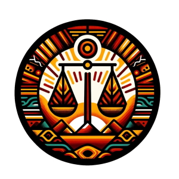

[Versión en Español](lac_es)

The Working Group on Equity and Justice for Indigenous Communities in the Americas (EJUCIAM from the group name in Spanish) focuses on addressing the historical and systemic inequalities faced by Indigenous peoples across the region. This collaborative effort brings together researchers, members of indigenous communities, activists, and community leaders to formulate policies, strategies, and programs that promote fairness, access to resources, and the protection of rights for Indigenous communities amongst other topics. By focusing on critical issues such as land rights, education, healthcare, and cultural preservation, the working group seeks to dismantle barriers and advocate for inclusive development that respects and integrates Indigenous knowledge and traditions. Through dialogue, research, and advocacy, this group endeavors to create a more equitable and just society, where the voices of Indigenous peoples are heard, respected, and integrated into the national fabric of countries in the Americas.

## MD4SG Summer of Science:
The EJUCIAM working group is an extension of the MD4SG Summer of Science program which supports female students from indigenous communities in Mexico as they design and execute research projects aimed at improving their local communities. In the past two years, we have supported more than 20 female researchers from 11 indigenous communities throughout Mexico (Cuanajo, Purépecha, Mixteco, Tepehuán, Rarámuri, Mazahua, Zapoteca, Náhuatl, Tének, Mazateca and Zoque).

## Structure:
The EJUCIAM working group meets virtually every two weeks on zoom. In our meetings we share and discuss work (typically in Spanish) from both our members and invited speakers which is of relevance to indigenous communities in the Americas.

## Relevant Themes:
- Human Rights
- Education
- Public Health
- Cultural Preservation
- Environmental Conservation

## Join Us:
If you’re interested in joining EJUCIAM and our broader initiatives around indigenous communities, please feel free to reach out to our working group organizers or fill out this form: https://forms.gle/7eE1dAoeJ1wMPmri9

## Working Group Organizer
|        Name         |     Position        |               Affiliation                   |
|--- |--- |--- |
|[Flor ángel Pérez Sánchez](https://www.uv.mx/citro/)|Master's Student in Tropical Ecology|CITRO|
|[Yésica Gómez Hernández](https://uatx.mx/)|Doctoral Student in Educational Research|UATx|

## Academic Advisor
|        Name         |     Position        |               Affiliation                   |
|--- |--- |--- |
|[Francisco Marmolejo Cossío](https://www.fmarmolejo.com/)|Postdoctoral Fellow|Harvard University|
|[Michelle González Amador](https://www.m-gonzalezamador.com/)|Doctoral Student|UNU-MERIT and Maastricht University|

## Working Group Members
|        Name         |     Position        |               Affiliation                   |
|--- |--- |--- |
|Adriana Santiago Marcelino|Master's Degree in Human Rights|UASLP|
|Alma Benita Cruz González|Master's Student in Social Medicine|UAM|
|Anai Domingo Martínez|Master's Student in Public Health|UASLP|
|Argelia Contreras Aguirre|Master's Student in Intercultural Education|UPNECH|
|Celeste Cristal Flores Cuevas|Master's Degree in Sustainable Water Management|COLSAN|
|Claudia Martínez Martínez|Master's Student in International Relations|UANL|
|Edna Marlene Martínez Hernández|Master's Student in Public Health Science|UANL|
|Idalia Rojas Martínez|Bachelor's Degree in Nursing with a Specialization in Obstetrics|UASLP|
|[Imelda Flores Vazquez](https://www.linkedin.com/in/dr-imelda-flores-vazquez-1a3262171/)|Senior Economist / Principal Investigator|Econometrica Inc.|
|Iridiana Salinas Hernández|Master's Student in Accounting|UANL|
|Leydi Rojas Martínez|Master's Student in Public Health Science|UANL|
|María del Rosario Félix Gaspar|Master's in Perinatal Nursing|UAEM|
|María Guadalupe García Alonso|Master's Student in Rural Development Science|UACh|
|María Guadalupe Márquez Hinojosa|Master's Student in Public Health|UASLP|
|María Rosario Niniz Silva|Master's Student in Public Health|UASLP|
|María Teresa Santiago Marcelino|Master's Student in Human Rights|UASLP|
|Nancy Santiago Santos|Bachelor's in Architecture|UASLP|
|Ofelia López Mejía|Postdoctoral Researcher in Law and Human Rights|UAS|
|[Paula Rodríguez Díaz](https://paularodrid.wordpress.com/)|Doctoral Student|Harvard University|
|Rosa Adriana Rivas Castillo|Bachelor's in Community Social Psychology|UAIM|
|[Ruben Martínez Cárdenas](https://rubenmtzc.netlify.app/)|Lecturer|University of York|
|[Tilsa Oré Mónago](https://profiles.rice.edu/faculty/tilsa-ore-monago)|Lecturer|Rice University|
|Viridiana Camacho Pánfilo|Doctoral Degree in History|Instituto Mora|
|Xóchitl Rosales Terán|Bachelor's Degree in Law|UASLP|
|Yazmin Cruz Cruz|Master's Student in Administrative Engineering|TNM|
